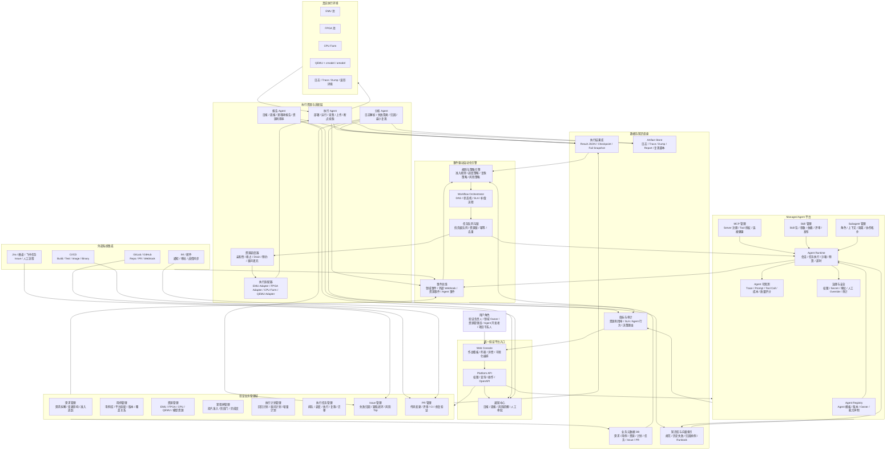

# 芯片软件验证自动化平台整体架构

> 图源文件：`architecture/chip-validation-platform-overall.mmd`
>
> 修改方式：可将 Mermaid 图源粘贴到 Mermaid Live Editor、draw.io 的 Mermaid 插入功能、ProcessOn Mermaid、Figma Mermaid 插件或其他画图工具中继续编辑。
>
> 如果需要先理解平台分层，优先看更简化的分层架构图：`architecture/chip-validation-platform-layered.md`。

## 1. 整体架构图

## 2. 架构分层

### 2.1 统一验证平台入口

面向不同角色提供统一工作台。验证负责人看投片准入、风险和里程碑；领域 Owner 看需求、用例、失败和闭环动作；资源管理员看 EMU、FPGA、CPU、QEMU 资源状态；Agent 开发者管理 MCP、Skill、Subagent 和 Agent 版本。

关键能力：
- 统一作战看板：资源利用率、任务吞吐、失败趋势、准入完成度。
- 统一操作入口：提交计划、暂停资源、人工复跑、指定 owner、审批高风险动作。
- 统一通知：日报、周报、夜间执行摘要、阻塞资源、投片风险 Top。

### 2.2 验证业务管理域

这是平台的数据管理主干，承载需求、用例、资源、里程碑、计划、任务、Issue、PR 等核心对象。它的职责不是直接执行自动化，而是沉淀清晰、可追溯、可解释的业务状态。

核心模块：
- 需求管理：需求拆解、覆盖关系、变更影响、投片准入项追踪。
- 用例管理：用例库、平台适配、版本、owner、风险等级、历史失败率。
- 资源管理：EMU、FPGA、CPU、QEMU、模型资源的状态、能力、健康和占用。
- 里程碑管理：阶段门、准入规则、完成度、风险项、延期影响。
- 执行计划管理：全量回归、冒烟回归、增量回归、夜间计划、专项定位计划。
- 执行任务管理：任务排队、调度、执行、采集、复跑、迁移、暂停、取消。
- Issue 管理：失败归因、缺陷闭环、已知问题、风险 Top、owner 推送。
- PR 管理：代码变更、CI、评审、修复验证、变更影响分析。

### 2.3 事件驱动自动化引擎

这是平台从“数据管理系统”升级为“自动化验证系统”的核心。所有业务对象变化、外部 webhook、资源心跳、Agent 结果都转化为事件，再由规则、Workflow 和队列驱动后续动作。

核心模块：
- 事件总线：统一承载需求变更、用例变更、资源状态变化、PR 更新、任务完成、Agent 输出。
- 规则与策略引擎：决定是否触发增量回归、复跑、定位、报告、通知、人工审批。
- Workflow Orchestrator：管理长流程状态机，例如夜间回归、失败分析、跨平台复现、最小复现。
- 任务队列与锁：保障优先级、资源互斥、幂等、去重和 Agent 冲突仲裁。

### 2.4 Managed Agent 平台

用于管理可插拔、可视化、可治理的 Agent 能力。它不只运行 Agent，还要管理 Agent 的版本、依赖、能力声明、权限、上下文、工具调用和执行质量。

核心模块：
- Agent Registry：登记调度 Agent、执行 Agent、失败分析 Agent、复跑 Agent、定位 Agent、报告 Agent 等。
- MCP 管理：注册 MCP Server、工具授权、连接健康检查、工具调用审计。
- Skill 管理：Skill 包管理、依赖、参数、版本、灰度、评审和发布。
- Subagent 管理：定义子 Agent 角色、上下文边界、协作拓扑和汇总策略。
- Agent Runtime：负责会话创建、上下文注入、工具调用、沙箱、预算、超时、重试。
- Agent 可观测：记录 prompt、tool call、trace、成本、耗时、输出质量和失败原因。
- 治理与安全：权限、Secret、审批、人工 override、操作审计、敏感资源保护。

### 2.5 执行资源与适配层

负责把平台计划和 Agent 决策落到真实资源上执行。这里需要显式隔离资源调度、平台适配、执行采集、失败分析和报告生成。

核心模块：
- 资源调度器：支持亲和性、抢占、drain、预约、夜间填充、debug 资源隔离。
- 执行适配器：屏蔽 EMU、FPGA、CPU Farm、QEMU+cmodel、QEMU+amodel 的差异。
- 执行 Agent：部署版本、运行用例、采集日志、上传产物、断点续跑。
- 分析 Agent：日志解析、失败聚类、初步归因、跨平台对比、最小复现生成。
- 报告 Agent：资源利用率、日报、周报、里程碑报告、风险报告。

### 2.6 数据与知识底座

所有自动决策必须有数据依据，所有结果必须可追溯。数据底座既服务业务查询，也服务调度策略、Agent 上下文和投片准入判断。

核心存储：
- 业务元数据 DB：需求、用例、资源、计划、任务、Issue、PR、里程碑。
- 执行结果库：Result JSON、checkpoint、fail snapshot、平台上下文、版本矩阵。
- Artifact Store：日志、trace、dump、报告、波形、截图、最小复现脚本。
- 知识库与向量索引：规范、历史失败、归因样例、Runbook、平台经验。
- 指标与审计：资源利用率、任务 SLA、Agent 行为、决策理由、人工 override。

## 3. 平台核心闭环

### 3.1 夜间无人值守闭环

1. 用户或系统生成夜间执行计划。
2. 事件总线发布 `execution.plan.created`。
3. 规则引擎根据优先级、资源稀缺性、平台适配、预计耗时生成任务队列。
4. 资源调度器选择空闲 EMU、FPGA、CPU、QEMU 资源。
5. 执行 Agent 部署版本、执行用例、采集日志和结果。
6. 失败分析 Agent 判断失败类型，决定复跑、跨平台复现、进入 debug 队列或生成 Issue。
7. 报告 Agent 汇总夜间吞吐、失败、阻塞、风险和资源利用率。

### 3.2 PR / 版本变更触发增量回归闭环

1. GitLab 或 GitHub Webhook 发布 `pr.updated`、`build.completed` 或 `version.released`。
2. 规则引擎结合需求、用例、模块、平台、版本矩阵计算影响范围。
3. 执行计划模块生成增量回归计划。
4. 调度器优先分配 QEMU / CPU 做快速筛查，再按风险升级到 EMU / FPGA。
5. 结果回写 PR、Issue、里程碑和报告。

### 3.3 失败定位闭环

1. 执行任务产生 fail snapshot。
2. 失败分析 Agent 拉取日志、trace、版本矩阵、历史失败和已知问题。
3. 如果是平台异常，触发换资源复跑或资源 unhealthy 隔离。
4. 如果是稳定失败，生成 Issue、推荐 owner，并创建定位任务。
5. 问题定位 Agent 选择 QEMU、EMU 或 FPGA 复现路径，必要时生成最小复现脚本。
6. 修复 PR 合入或版本更新后，自动触发修复验证。

## 4. 模块细化顺序建议

建议按下面顺序继续展开二级图和字段模型：

1. 资源管理与调度：先定义资源状态、资源能力、资源锁、调度策略，因为它决定 EMU / FPGA 稀缺资源能否被高效使用。
2. 执行计划与执行任务：定义计划、任务、状态机、结果协议、日志协议、断点续跑协议。
3. Managed Agent 平台：定义 Agent、MCP、Skill、Subagent、Runtime、权限和观测数据模型。
4. 事件驱动引擎：定义事件规范、事件源、规则配置、Workflow 状态机和补偿机制。
5. 失败分析与 Issue 闭环：定义 fail snapshot、归因分类、复跑策略、Issue 生成和修复验证。
6. PR 与增量回归：定义代码变更到需求、模块、用例、平台、版本矩阵的映射。
7. 里程碑与报告：定义投片准入项、完成度、风险 Top、日报周报和资源预测。

## 5. 第一版边界建议

第一版不要追求所有 Agent 都智能化。更稳妥的落地方式是先把状态、事件、结果协议和资源锁做扎实：

- P0：统一资源登记、任务提交、执行结果归档、Result JSON、日志产物、基础看板。
- P1：事件总线、资源空闲自动调度、夜间执行、失败自动复跑、资源 unhealthy 隔离。
- P2：Managed Agent Registry、MCP/Skill 可视化管理、Agent Runtime、Trace 审计。
- P3：增量回归、跨平台定位、失败聚类、最小复现、风险预测。
