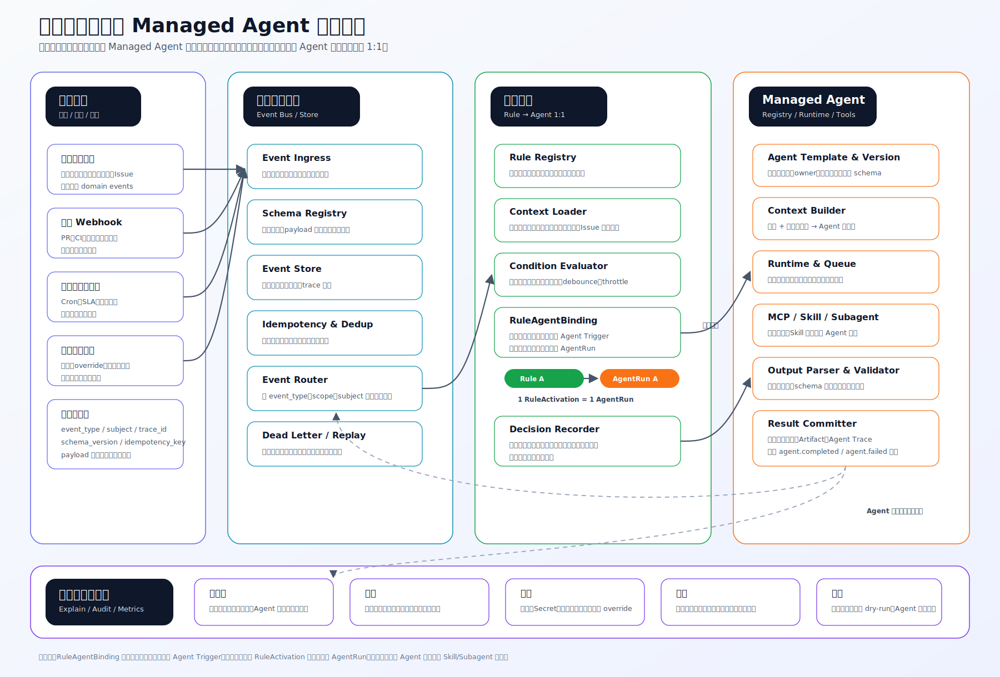
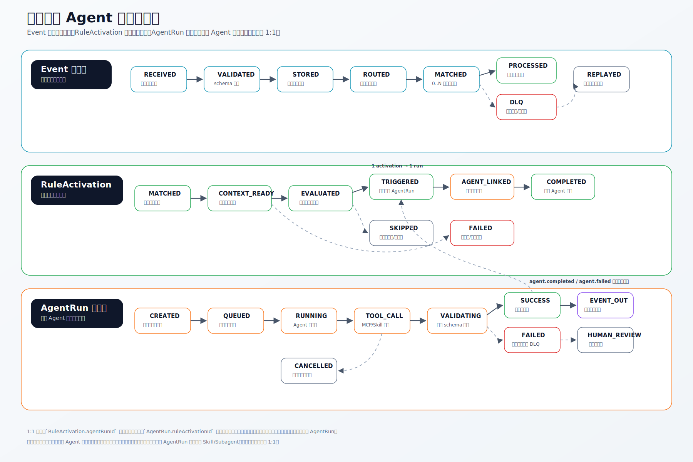

# 芯片软件验证自动化平台最终设计文档

> 本文是 `architecture/` 目录下所有流程和二级设计的总设计文档。
>
> 参考基础：`CATP_Platform` 已实现能力只作为参考，不作为本文约束。本文目标是定义面向芯片软件验证团队的自动化验证平台最终架构、核心闭环、模块边界、数据模型和可视化方式。

## 1. 设计目标

平台要同时解决两类问题：

1. **验证数据管理**：统一管理需求、用例、资源、里程碑、执行计划、执行任务、Issue、PR、结果和 artifact。
2. **自动化流程执行**：通过 Managed Agent 平台、事件驱动引擎和规则引擎，把验证流程自动串起来，包括资源调度、用例选择、执行、复跑、失败分析、修复验证和报告。

最终平台不只是一个任务系统，也不是单纯的 Agent 执行器，而是一个以业务对象为中心、以事件为驱动、以 Agent 为执行能力、以可视化和审计为保障的自动化验证平台。

## 2. 总览图

### 2.1 端到端闭环


核心链路：

```text
需求 / PR / 人工计划 / 里程碑
  -> EventRecord
  -> AutomationRule
  -> RuleActivation
  -> AgentRun
  -> ExecutionPlan / ResourceRequest / FailureIssue / Report
  -> 新事件
```

每次自动化动作都必须能回答：

- 这个动作由哪个事件触发。
- 哪条规则命中，命中条件是什么。
- 哪个 Agent 版本执行，使用了哪些 MCP、Skill、Subagent。
- 读了哪些上下文，产生了哪些证据。
- 是否需要人工审批或人工确认。
- 输出最终写入了哪个业务对象。

### 2.2 核心领域数据关系


这张图用于指导数据库、API 和事件边界。核心约束如下：

- `ExecutionGraph` 是执行时 DAG 快照，后续用例标注变化不应悄悄改变正在运行的计划。
- FPGA / EMU 节点必须关联 `ResourceRequest` 或已确认的 `ResourceLease`。
- `PlatformExecutionResult` 失败后必须生成 `FailSnapshot`，作为后续 Issue、复跑、定位和关闭证据。
- `FailureIssue` 关闭必须有最近一次 `CloseGateEvaluation.allowed=true`。
- `AutomationRule -> RuleAgentBinding -> AgentTriggerConfig` 在配置层 1:1。
- `RuleActivation -> AgentRun` 在运行层 1:1。

## 3. 五层架构


### 3.1 第一层：基础资源与存储层

| 模块 | 职责 | 关键约束 |
| --- | --- | --- |
| SQL DB | 保存需求、用例、资源、计划、任务、Issue、PR、Agent、规则等业务元数据 | 状态变化必须可追溯；大日志不进 SQL |
| S3 / MinIO | 保存日志、trace、dump、波形、报告、最小复现包 | 关键失败现场需要 checksum、权限和保留策略 |
| Redis | 队列缓存、分布式锁、资源心跳、短期状态 | 锁必须有 owner、TTL、续约和幂等键 |
| EMU | 中后期 RTL 行为验证、复杂状态、trace 定位 | 稀缺、不可虚拟化，默认独占租约 |
| FPGA | 真实硬件软件栈验证、长稳、系统级闭环 | 真实环境依赖强，抢占需审批和现场保护 |
| CPU Farm | 编译、QEMU、日志分析、报告生成 | 区分交互式、批处理和高内存节点 |
| QEMU + cmodel / amodel | 快速 bring-up、功能回归、预筛、最小复现 | model unsupported 不能直接视为真实失败 |
| Git Repo / CI | PR、commit、branch、build、binary、image 来源 | 每次执行必须绑定完整版本矩阵 |

### 3.2 第二层：平台组件与能力层

| 模块 | 职责 |
| --- | --- |
| K8s / Worker Runtime | 运行 Worker、Agent Runtime、日志解析、报告、周期任务 |
| Queue / Lock | 优先级队列、资源互斥、Agent 冲突仲裁、幂等去重 |
| Log Pipeline | 收集、索引、解析执行日志、资源日志、Agent Trace |
| MCP 组件 | 管理 MCP Server、Tool Gateway、工具授权、调用审计 |
| Skill 组件 | 管理 Skill 包、参数、依赖、评审、灰度和发布 |
| Subagent 组件 | 管理子 Agent 角色、上下文隔离、协作拓扑和汇总策略 |
| Artifacts 组件 | 管理日志、trace、dump、波形、报告、最小复现脚本索引 |
| Observability | 平台指标、资源指标、任务 SLA、Agent 成本和质量 |
| Secret / Access | 凭据、权限、危险动作审批、越权防护 |

### 3.3 第三层：管理模块与规则编排层

| 模块 | 核心职责 |
| --- | --- |
| 需求管理 | 需求拆解、覆盖关系、变更影响、准入项追踪 |
| 用例管理 | 用例库、平台适配、版本、owner、风险等级、历史质量 |
| 资源管理 | FPGA、EMU、CPU、QEMU 状态、能力、健康、占用、预约 |
| 里程碑管理 | 阶段门、投片准入、完成度、风险 Top、延期影响 |
| 执行计划管理 | 全量、冒烟、增量、夜间、专项定位计划 |
| 执行任务管理 | 排队、调度、执行、采集、复跑、迁移、暂停、取消 |
| Issue 管理 | 失败归因、缺陷闭环、已知问题、owner 分派、风险升级 |
| PR 管理 | PR、commit、CI、变更影响、修复验证、准入建议 |
| 规则引擎 | 准入规则、调度策略、复跑策略、风险策略、审批策略 |
| 事件驱动与流程编排 | 事件总线、状态机、DAG、SLA、补偿流程 |

### 3.4 第四层：Agent 层

Agent 必须有明确目的，不能泛化成万能 Agent。所有 Agent 通过平台 API、规则引擎、MCP、Skill 和 Subagent 工作，不能绕过平台直接修改核心状态。

| Agent | 触发来源 | 输出 |
| --- | --- | --- |
| 资源调度 Agent | 计划创建、资源释放、租约到期、P0 申请 | 分配建议、抢占建议、预约建议、drain 建议 |
| 用例选择 Agent | 需求变更、PR 更新、版本发布、里程碑门禁 | 冒烟、增量、全量、风险加权用例集合 |
| 执行 Agent | CaseExecutionNode READY、ResourceLease granted | Result JSON、artifact 索引、资源状态回写 |
| 失败分析 Agent | FailSnapshot created | 失败摘要、归因分类、置信度、owner 建议 |
| Duplicate / Cluster Agent | FailSnapshot created | 追加已有 Issue 或创建新 Issue 建议 |
| 复跑 Agent | 失败分析结果、infra fail、flaky 判断 | 同平台、换资源、跨平台、失败子集复跑计划 |
| 问题定位 Agent | 稳定失败、Owner 请求、P0 定位 | trace、二分、最小复现、跨平台对比计划 |
| Fix Verification Agent | FixProposal opened、PR updated | VerificationPlan、required checks |
| Close Gate Agent | VerificationPlan completed、Issue close requested | 是否允许关闭、阻塞原因、证据检查 |
| 报告 Agent | 夜间计划完成、里程碑风险变化 | 日报、周报、夜间摘要、投片风险 Top |
| 治理守护 Agent | 高风险工具调用、危险资源动作 | 允许、拒绝、需要审批、需要人工确认 |

### 3.5 第五层：展示与协同层

| 页面 | 核心能力 |
| --- | --- |
| Dashboard | 资源利用率、任务吞吐、失败趋势、投片准入、里程碑风险 |
| 验证工作台 | 需求、用例、计划、任务、Issue、PR 的日常操作入口 |
| 资源可视化 | 资源地图、时间线、队列、租约详情、健康、调度解释、审批 |
| 用例执行视图 | 平台映射矩阵、执行 DAG、跨平台结果矩阵、跳过和阻断原因 |
| Failure Board | 类 GitHub Project 的失败看板、Issue 详情、PR/checks、Close Gate |
| Agent Studio | Agent、MCP、Skill、Subagent、工具权限、运行记录和版本发布 |
| 报告与通知 | 日报、周报、夜间执行摘要、风险提醒、阻塞升级 |
| 管理与配置 | 用户、角色、项目空间、字典、规则、资源、外部集成 |

## 4. 资源管理与调度

> 详细设计：`resource-management-scheduling.md`
>
> 数据模型：`resource-management-data-model.md`

### 4.1 二级架构


资源管理与调度模块负责把 FPGA、EMU、CPU Farm、QEMU+cmodel、QEMU+amodel 统一纳管，并在“人”和“程序”之间做可解释、可中断、可审计的分配。

关键设计：

- **优先级**：P0 投片阻塞、P1 高风险定位、夜间回归、普通任务有明确排序。
- **中断**：低价值任务占用稀缺设备时，高价值任务可申请抢占，但必须保护现场。
- **不可虚拟化设备**：FPGA / EMU 默认不能虚拟化，必须通过独占租约避免冲突。
- **人和程序共享**：人工调试、自动回归、CI、Agent 任务都走 `ResourceRequest`。
- **昼夜策略**：白天 `Human First`，夜间 `Program Fill`，P0 可覆盖但不能跳过审计。

### 4.2 状态机


中断语义：

| 类型 | 语义 | 适用场景 |
| --- | --- | --- |
| `DRAIN` | 不接新阶段，运行到安全退出点后释放 | 长回归、阶段性测试 |
| `CHECKPOINT` | 保存现场、进度、命令、artifact 后释放 | 可恢复任务、QEMU/CPU/部分 EMU 流程 |
| `MIGRATE` | checkpoint 后换资源继续 | CPU/QEMU 或兼容资源 |
| `FORCE` | 强制终止 | 只允许 P0 + 审批 + 现场保护 |

FPGA/EMU 如果正在人工 debug 或失败现场保护，默认不抢占，除非 owner 释放或审批通过。

### 4.3 资源可视化


资源页面需要支持：

- 资源地图：按 FPGA、EMU、CPU、QEMU 展示状态、owner、租约和健康。
- 时间线：展示预约、占用、夜间计划、maintenance、drain、health outage。
- 队列视图：展示 `effectiveScore`、优先级、等待时间和等待原因。
- 租约详情：续约、释放、抢占、drain、现场保护。
- 调度解释：展示命中规则、分数明细、候选资源和拒绝原因。
- 审批中心：处理抢占、强制释放和危险操作。

## 5. 用例执行编排

> 详细设计：`use-case-execution-orchestration.md`
>
> 数据模型：`use-case-execution-data-model.md`

### 5.1 二级架构


用例执行模块回答四个问题：

1. 一个用例在哪些平台执行。
2. 各平台按什么顺序执行。
3. 失败后是否继续。
4. 最终结论来自哪个平台。

平台路线不能固定为一条。系统支持：

- `QEMU -> EMU -> FPGA`
- `QEMU -> EMU`
- `QEMU -> FPGA`
- `EMU-only`
- `FPGA-only`
- `QEMU-only`

### 5.2 DAG 与状态机


核心规则：

- 平台归属由人标注，Agent 可建议但不能无痕覆盖。
- 用例是 DAG，不是线性列表。
- 基础 gate 失败后，下游 blocking 节点进入 `BLOCKED`。
- QEMU 作为 `PRECHECK` 失败后，后续 EMU/FPGA 节点可进入 `SKIPPED`。
- QEMU `model_unsupported` 不能当成真实失败，应转入 EMU/FPGA 或人工审核。
- 最终报告必须说明结论来源是 QEMU、EMU、FPGA 还是人工审核。

## 6. 通用事件规则与 Managed Agent 编排

> 详细设计：`automation-orchestration.md`
>
> 数据模型：`automation-orchestration-data-model.md`

### 6.1 架构



这是平台级通用模块，不属于某一个业务域。需求、用例、资源、执行、Issue、PR、里程碑都可以通过它发布事件、配置规则、触发 Agent。

核心链路：

```text
Event -> Rule Match -> RuleActivation -> AgentRun -> Agent Result -> Event
```

### 6.2 状态机



1:1 触发约束：

```text
AutomationRule 1 -- 1 RuleAgentBinding 1 -- 1 AgentTriggerConfig
RuleActivation 1 -- 1 AgentRun
```

一个事件可以命中多条规则；每条规则命中生成一个 `RuleActivation`；每个 `RuleActivation` 只能创建一个 `AgentRun`。如果一个业务目标需要多个 Agent 协作，要么拆成多条规则，要么由一个 AgentRun 内部使用 subagent。

## 7. 用例失败分析 Issue/PR 闭环

> 详细设计：`failure-analysis-issue-pr.md`
>
> 数据模型：`failure-analysis-issue-pr-data-model.md`

### 7.1 架构


失败分析参考 GitHub Issue 和 PR 的协作模型：

- `FailureIssue` 像 GitHub Issue：title、status、severity、priority、owner、milestone、labels、timeline、duplicate、related、close criteria。
- `FixProposal` / `External PR` 像 GitHub PR：代码修复、配置修复、用例修复、平台修复、workaround、waiver。
- `VerificationCheck` 像 PR checks：QEMU、EMU、FPGA、CI、长稳、回归切片。
- `CloseGateEvaluation` 像 merge gate：证据、checks、owner、风险接受共同决定是否能关闭。

### 7.2 状态机


推荐流程：

1. `CaseExecutionNode` 失败，生成 `FailSnapshot`。
2. `fail_snapshot.created` 触发 Triage Agent。
3. Duplicate / Cluster Agent 判断是否追加到已有 Failure Issue。
4. 新失败创建 Failure Issue，自动打标签、分级、推荐 owner。
5. Owner 确认后进入分析，生成复现计划或定位计划。
6. 修复产生 FixProposal 或关联外部 PR。
7. Fix Verification Agent 生成 VerificationPlan 和 required checks。
8. QEMU/EMU/FPGA 验证结果回写 Issue timeline。
9. Close Gate Agent 评估是否允许关闭。
10. 满足证据和 checks 后关闭；否则回到分析或修复状态。

关闭 resolution：

| Resolution | 必要条件 |
| --- | --- |
| `fixed` | 修复 PR merged 或 fix proposal approved；required checks passed；owner approved |
| `duplicate` | 有主 Issue 链接 |
| `known_issue` | 有已知问题链接和影响范围 |
| `waived` | 有风险接受审批 |
| `not_reproducible` | 多次复跑不复现且保存证据 |
| `obsolete` | 版本或用例已废弃，有变更证据 |

## 8. 跨模块协议

### 8.1 Event Schema

所有事件必须包含：

| 字段 | 说明 |
| --- | --- |
| `event_id` | 全局唯一事件 ID |
| `event_type` | 事件类型，例如 `execution.node.failed` |
| `source` | 事件来源模块 |
| `occurred_at` | 事件发生时间 |
| `trace_id` | 跨模块追踪 ID |
| `idempotency_key` | 幂等键 |
| `subject_type` / `subject_id` | 事件主体 |
| `payload_version` | payload 版本 |
| `payload` | 结构化事件内容 |

典型事件：

```text
requirement.changed
case.updated
resource.heartbeat
resource.lease.expiring
plan.created
execution.node.failed
fail_snapshot.created
failure_issue.opened
fix_proposal.opened
verification_plan.completed
pr.updated
agent.completed
milestone.risk.changed
```

### 8.2 Result JSON

每次执行必须输出统一结果结构：

```json
{
  "task_id": "task-001",
  "case_id": "case-boot-api",
  "execution_node_id": "node-001",
  "platform": "QEMU_CMODEL",
  "resource_id": "qemu-pool-a",
  "version_matrix_id": "vm-2026-06-14-nightly",
  "stage": "run",
  "checkpoint": "after_boot",
  "result": "fail",
  "reason": "assertion mismatch",
  "expected": "doorbell=1",
  "actual": "doorbell=0",
  "artifact_refs": ["s3://catp/logs/task-001/case.log"],
  "repro_command": "./run_case.sh --case boot-api --seed 42"
}
```

结果状态至少支持：

```text
pass / fail / skip / blocked / timeout / infra_fail / model_unsupported
```

### 8.3 Version Matrix

每次执行必须绑定：

- RTL / IP / SoC 版本。
- FPGA bitstream。
- EMU build。
- QEMU、cmodel、amodel 版本。
- firmware、driver、runtime、compiler。
- test case、脚本、配置文件版本。

版本矩阵用于判断失败是否由版本变化引入，也用于增量回归选择和修复验证。

### 8.4 Resource Lease

FPGA / EMU 的资源租约必须包含：

- resource unit。
- owner 和 consumer type。
- priority。
- lease TTL 和续约状态。
- interruptibility。
- checkpoint / drain 能力。
- 当前任务、计划、用例、版本矩阵。
- 调度决策理由。
- 审批和人工 override 记录。

### 8.5 Agent Output

Agent 输出必须结构化：

| 字段 | 说明 |
| --- | --- |
| `summary` | 结论摘要 |
| `confidence` | 置信度 |
| `evidenceRefs` | 日志、trace、Issue、PR、规则命中等证据 |
| `recommendedActions` | 建议动作 |
| `requiresHumanApproval` | 是否需要人工确认 |
| `emittedEvents` | 后续事件 |

高风险动作必须由 Result Committer 或业务模块根据权限和审批策略提交，Agent 不能直接绕过平台写核心状态。

## 9. 可视化总设计

最终平台至少需要以下可视化页面。

### 9.1 总 Dashboard

面向验证负责人：

- 里程碑准入状态。
- 需求覆盖率、用例通过率、阻塞 Issue。
- 夜间计划完成度、失败趋势、资源利用率。
- 投片风险 Top、需要人工决策项。

### 9.2 资源可视化

面向资源管理员和 Owner：

- FPGA / EMU / CPU / QEMU 资源地图。
- 昼夜策略命中情况。
- 当前租约、剩余时间、是否可抢占。
- 队列分数和等待原因。
- 健康状态、隔离原因、下一个预约窗口。

### 9.3 用例执行视图

面向用例 Owner：

- 平台映射矩阵：用例 x QEMU/EMU/FPGA。
- 执行 DAG：平台节点、依赖边、gate、状态、跳过原因。
- 跨平台结果矩阵：结果来源、最终结论、风险说明。

### 9.4 Failure Board

面向失败分析和修复闭环：

- Open / Triaging / Assigned / Analyzing / Fix Ready / Verifying / Resolved / Closed。
- Issue 详情：FailSnapshot、timeline、labels、owner、milestone、relations。
- PR/checks：FixProposal、VerificationPlan、QEMU/EMU/FPGA checks。
- Close Gate：是否允许关闭和阻塞原因。

### 9.5 Agent Studio

面向 Agent 开发和平台治理：

- Agent Registry：模板、版本、owner、能力声明。
- MCP 管理：Server、Tool、授权、健康状态。
- Skill 管理：包、参数、依赖、评审、发布。
- Subagent 管理：角色、上下文边界、协作拓扑。
- Agent Run Trace：prompt、tool call、成本、耗时、输出质量。
- 权限和审批：危险动作、Secret、人工 override。

## 10. 关键闭环

### 10.1 夜间无人值守回归

```text
night_schedule.created
  -> 规则命中夜间计划 Agent
  -> 生成 ExecutionPlan
  -> 生成 ExecutionGraph
  -> QEMU/CPU 快速填充
  -> FPGA/EMU Program Fill
  -> Result JSON 和 artifacts 归档
  -> 失败进入 Failure Issue
  -> Report Agent 输出夜间摘要
```

### 10.2 PR 触发增量回归

```text
pr.updated / build.completed
  -> 变更影响 Agent
  -> 影响需求、模块、用例、平台
  -> 生成增量 ExecutionPlan
  -> QEMU 预筛
  -> 高风险升级 EMU/FPGA
  -> VerificationCheck 回写 PR 和 FailureIssue
```

### 10.3 失败分析与修复验证

```text
execution.node.failed
  -> FailSnapshot
  -> Triage Agent
  -> Duplicate / Cluster Agent
  -> FailureIssue
  -> Owner Routing
  -> Repro Plan / FixProposal
  -> VerificationPlan
  -> QEMU/EMU/FPGA checks
  -> CloseGateEvaluation
```

### 10.4 人工资源调试

```text
human.resource.requested
  -> ResourceRequest
  -> 白天 Human First 策略加权
  -> 检查 FPGA/EMU 独占租约
  -> 必要时触发 drain / checkpoint / approval
  -> ResourceLease granted
  -> Dashboard 展示 owner、TTL、现场保护
```

## 11. 模块交付边界

第一版优先把状态、事件、结果协议和资源锁做扎实。建议分阶段落地：

| 阶段 | 目标 | 关键产出 |
| --- | --- | --- |
| P0 | 数据主干和基础执行闭环 | 资源登记、用例管理、计划任务、Result JSON、artifact 归档、基础 Dashboard |
| P1 | 可用的调度和夜间自动化 | 资源租约、昼夜策略、任务队列、夜间执行、失败复跑、资源 unhealthy 隔离 |
| P2 | Managed Agent 平台 | Agent Registry、MCP/Skill/Subagent 管理、Agent Runtime、Trace 审计 |
| P3 | 智能化失败闭环 | 失败聚类、Issue/PR 闭环、修复验证 checks、Close Gate |
| P4 | 增量回归和投片准入 | PR 影响分析、用例选择 Agent、里程碑门禁、风险预测 |

## 12. 设计约束清单

- 平台必须以业务对象为中心，Agent 是执行能力，不是状态真相来源。
- 所有自动化动作必须有事件、规则、Agent 版本、输入上下文、输出证据和审计记录。
- FPGA / EMU 不可虚拟化，默认独占租约。
- 白天优先人工，夜间优先程序，但 P0、预约、现场保护和审批可覆盖默认策略。
- 用例平台归属由人标注，Agent 只能建议。
- QEMU precheck fail 可以跳过后续 FPGA/EMU；model unsupported 不能当作真实失败。
- 基础 gate 失败可以阻断下游 DAG 节点。
- 失败先形成 FailSnapshot，再进入 Issue/PR 闭环。
- Issue 关闭必须有证据门禁，不能只靠口头确认。
- 规则和 Agent 触发关系在配置层和运行层都保持 1:1。
- Artifact 大文件存 S3 / MinIO，索引和状态存 SQL。
- Version Matrix 是执行、复跑、归因、增量回归和修复验证的共同基础。

## 13. 子文档索引

| 子文档 | 内容 |
| --- | --- |
| `chip-validation-platform-layered.md` | 五层分层架构 |
| `chip-validation-platform-module-details.md` | 每个模块职责、输入、输出和关键设计点 |
| `resource-management-scheduling.md` | 资源管理与调度二级架构、状态机、可视化 |
| `resource-management-data-model.md` | 资源、请求、租约、调度策略、中断、可视化数据模型 |
| `automation-orchestration.md` | 通用事件规则与 Managed Agent 编排设计 |
| `automation-orchestration-data-model.md` | Event、Rule、Binding、AgentRun、ToolCall、Action 数据模型 |
| `use-case-execution-orchestration.md` | 用例执行平台路线、DAG、QEMU precheck、基础 gate |
| `use-case-execution-data-model.md` | TestCase、平台标注、ExecutionGraph、CaseNode、Result 数据模型 |
| `failure-analysis-issue-pr.md` | 类 GitHub Issue/PR 的失败分析闭环 |
| `failure-analysis-issue-pr-data-model.md` | FailSnapshot、FailureIssue、FixProposal、VerificationCheck、CloseGate 数据模型 |

## 14. 最终结论

该设计把芯片软件验证平台拆成五层：基础资源与存储、平台组件与能力、业务管理与规则编排、明确目的的 Agent、展示与协同。业务模块负责沉淀真实状态，事件规则模块负责触发自动化，Managed Agent 平台负责可插拔能力治理，资源调度模块负责稀缺硬件的可解释分配，用例执行模块负责多平台 DAG 编排，失败分析模块负责把失败转成类似 GitHub Issue/PR 的可闭环工程对象。

最终平台应优先保证四件事：状态可信、资源可控、证据完整、自动化可解释。智能 Agent 能力在这个基础上逐步增强，才不会变成黑盒流程。
