# 芯片软件验证自动化平台最终设计文档

> 本文是 `architecture/` 目录下所有流程和二级设计的总设计文档。
>
> 参考基础：`CATP_Platform` 已实现能力只作为参考，不作为本文约束。本文目标是定义面向芯片软件验证团队的自动化验证平台最终架构、核心闭环、模块边界、数据模型和可视化方式。

## 1. 设计目标

平台要同时解决两类问题：

1. **验证数据管理**：统一管理需求、用例、资源、里程碑、执行计划、执行任务、Issue、PR、结果和 artifact。
2. **自动化流程执行**：通过固定业务规则、执行驱动器、资源调度和 Agent Runtime，把验证流程自动串起来，包括资源调度、用例选择、执行、复跑、失败分析、修复验证和报告。

最终平台不只是一个任务系统，也不是单纯的 Agent 执行器，而是一个以业务对象为中心、以事件为驱动、以 Agent 为执行能力、以可视化和审计为保障的自动化验证平台。

## 2. 五层架构

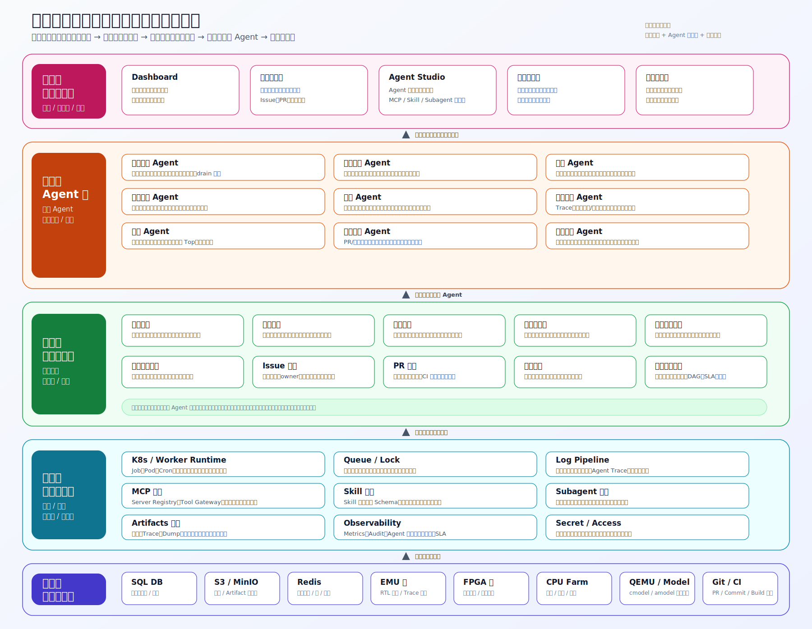

### 2.1 第一层：基础资源与存储层

| 模块                   | 职责                                                                 | 关键约束                                  |
| ---------------------- | -------------------------------------------------------------------- | ----------------------------------------- |
| SQL DB                 | 保存需求、用例、资源、计划、任务、Issue、PR、Agent、规则等业务元数据 | 状态变化必须可追溯；大日志不进 SQL        |
| S3 / MinIO             | 保存日志、trace、dump、波形、报告、最小复现包                        | 关键失败现场需要 checksum、权限和保留策略 |
| Redis                  | 队列缓存、分布式锁、资源心跳、短期状态                               | 锁必须有 owner、TTL、续约和幂等键         |
| EMU                    | 中后期 RTL 行为验证、复杂状态、trace 定位                            | 稀缺、不可虚拟化，默认独占租约            |
| FPGA                   | 真实硬件软件栈验证、长稳、系统级闭环                                 | 真实环境依赖强，抢占需审批和现场保护      |
| CPU Farm               | 编译、QEMU、日志分析、报告生成                                       | 区分交互式、批处理和高内存节点            |
| QEMU + cmodel / amodel | 快速 bring-up、功能回归、预筛、最小复现                              | model unsupported 不能直接视为真实失败    |
| Git Repo / CI          | PR、commit、branch、build、binary、image 来源                        | 每次执行必须绑定完整版本矩阵              |

### 2.2 第二层：平台组件与能力层

| 模块                 | 职责                                                 |
| -------------------- | ---------------------------------------------------- |
| K8s / Worker Runtime | 运行 Worker、Agent Runtime、日志解析、报告、周期任务 |
| Queue / Lock         | 优先级队列、资源互斥、Agent 冲突仲裁、幂等去重       |
| Hardware Scheduler / labgrid Gateway | 统一硬件资源申请、排队、租约、抢占、释放，并封装 labgrid acquire/release |
| Log Pipeline         | 收集、索引、解析执行日志、资源日志、Agent Trace      |
| MCP 组件             | 管理 MCP Server、Tool Gateway、工具授权、调用审计    |
| Skill 组件           | 管理 Skill 包、参数、依赖、评审、灰度和发布          |
| Subagent 组件        | 管理子 Agent 角色、上下文隔离、协作拓扑和汇总策略    |
| Artifacts 组件       | 管理日志、trace、dump、波形、报告、最小复现脚本索引  |
| Observability        | 平台指标、资源指标、任务 SLA、Agent 成本和质量       |
| Secret / Access      | 凭据、权限、危险动作审批、越权防护                   |

### 2.3 第三层：管理模块与业务规则层

| 模块           | 核心职责                                           |
| -------------- | -------------------------------------------------- |
| 需求管理       | 需求拆解、覆盖关系、变更影响、准入项追踪           |
| 用例管理       | 用例库、平台适配、版本、owner、风险等级、历史质量  |
| 资源管理       | FPGA、EMU、CPU、QEMU 状态、能力、健康、占用、预约  |
| 里程碑管理     | 阶段门、投片准入、完成度、风险 Top、延期影响       |
| 执行计划管理   | 全量、冒烟、增量、夜间、专项定位计划               |
| 执行任务管理   | 排队、调度、执行、采集、复跑、迁移、暂停、取消     |
| Issue 管理     | 失败归因、缺陷闭环、已知问题、owner 分派、风险升级 |
| PR 管理        | PR、commit、CI、变更影响、修复验证、准入建议       |
| 规则引擎       | 准入规则、调度策略、复跑策略、风险策略、审批策略   |
| 事件记录与审计 | 事件总线、幂等键、状态变化记录、SLA、补偿记录      |

### 2.4 第四层：Agent 层

Agent 必须有明确目的，不能泛化成万能 Agent。所有 Agent 通过平台 API、规则引擎、MCP、Skill 和 Subagent 工作，不能绕过平台直接修改核心状态；资源调度 Agent 只能生成分配、抢占和预约建议，真正的硬件 acquire/release 由基础设施层的 Hardware Scheduler 执行。

| Agent                     | 触发来源                                          | 输出                                     |
| ------------------------- | ------------------------------------------------- | ---------------------------------------- |
| 资源调度 Agent            | 计划创建、资源释放、租约到期、P0 申请             | 分配建议、抢占建议、预约建议、drain 建议 |
| 用例选择 Agent            | 需求变更、PR 更新、版本发布、里程碑门禁           | 冒烟、增量、全量、风险加权用例集合       |
| 执行 Agent                | ExecutionDriver 下发、ResourceLease granted       | Result JSON、artifact 索引、资源状态回写 |
| 失败分析 Agent            | FailSnapshot created                              | 失败摘要、归因分类、置信度、owner 建议   |
| Duplicate / Cluster Agent | FailSnapshot created                              | 追加已有 Issue 或创建新 Issue 建议       |
| 复跑 Agent                | 失败分析结果、infra fail、flaky 判断              | 同平台、换资源、跨平台、失败子集复跑计划 |
| 问题定位 Agent            | 稳定失败、Owner 请求、P0 定位                     | trace、二分、最小复现、跨平台对比计划    |
| Fix Verification Agent    | FixProposal opened、PR updated                    | VerificationPlan、required checks        |
| Close Gate Agent          | VerificationPlan completed、Issue close requested | 是否允许关闭、阻塞原因、证据检查         |
| 报告 Agent                | 夜间计划完成、里程碑风险变化                      | 日报、周报、夜间摘要、投片风险 Top       |
| 治理守护 Agent            | 高风险工具调用、危险资源动作                      | 允许、拒绝、需要审批、需要人工确认       |

### 2.5 第五层：展示与协同层

| 页面          | 核心能力                                                        |
| ------------- | --------------------------------------------------------------- |
| Dashboard     | 资源利用率、任务吞吐、失败趋势、投片准入、里程碑风险            |
| 验证工作台    | 需求、用例、计划、任务、Issue、PR 的日常操作入口                |
| 资源可视化    | 资源地图、时间线、队列、租约详情、健康、调度解释、审批          |
| 用例执行视图  | 平台映射矩阵、执行 DAG、跨平台结果矩阵、跳过和阻断原因          |
| Failure Board | 类 GitHub Project 的失败看板、Issue 详情、PR/checks、Close Gate |
| Agent Studio  | Agent、MCP、Skill、Subagent、工具权限、运行记录和版本发布       |
| 报告与通知    | 日报、周报、夜间执行摘要、风险提醒、阻塞升级                    |
| 管理与配置    | 用户、角色、项目空间、字典、规则、资源、外部集成                |

## 3. 总览图

### 3.1 端到端闭环

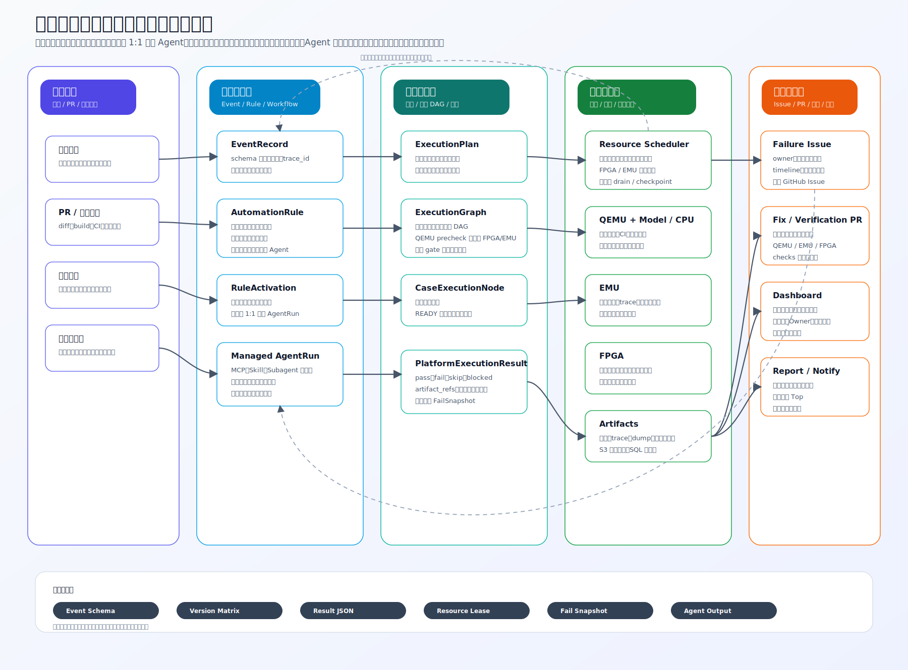

核心链路：

```text
需求 / PR / 人工计划 / 里程碑
  -> EventRecord
  -> 固定业务规则
  -> ExecutionPlan / ResourceRequest / AgentRun / FailureIssue / Report
  -> 新事件
```

每次自动化动作都必须能回答：

- 这个动作由哪个事件触发。
- 哪条规则命中，命中条件是什么。
- 哪个 Agent 版本执行，使用了哪些 MCP、Skill、Subagent。
- 读了哪些上下文，产生了哪些证据。
- 是否需要人工审批或人工确认。
- 输出最终写入了哪个业务对象。

### 3.2 核心领域数据关系

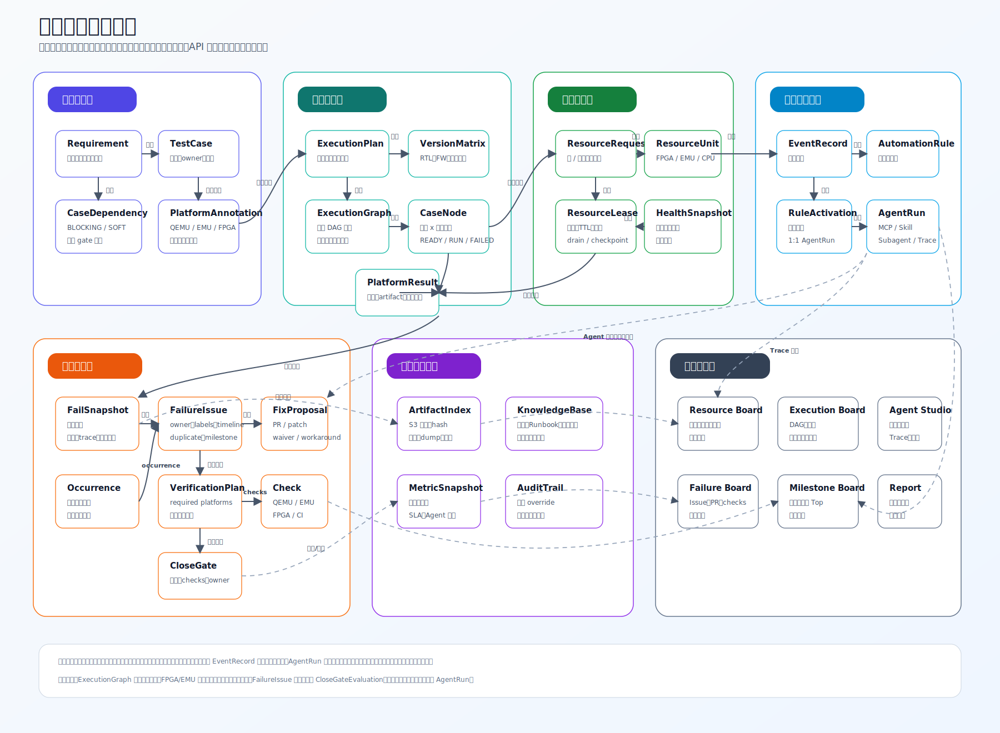

这张图用于指导数据库、API 和事件边界。核心约束如下：

- `ExecutionGraph` 是执行时 DAG 快照，后续用例标注变化不应悄悄改变正在运行的计划。
- FPGA / EMU 节点必须关联 `ResourceRequest` 或已确认的 `ResourceLease`。
- `PlatformExecutionResult` 失败后必须生成 `FailSnapshot`，作为后续 Issue、复跑、定位和关闭证据。
- `FailureIssue` 关闭必须有最近一次 `CloseGateEvaluation.allowed=true`。
- 自动触发 Agent 必须绑定固定业务规则和幂等键，避免同一业务目标重复运行。
- 固定业务规则触发 Agent 时，配置层保持一个业务目标绑定一个 Agent 触发配置，运行层保持一个规则命中只生成一个等价 `AgentRun`。
- 所有硬件资源入口必须先经过 Hardware Scheduler，再访问 labgrid；Jenkins 不能继续绕过调度层直接持有 labgrid 决策权。
- labgrid 是底层 place 锁、状态和 host 控制脚本接口，不承载业务优先级、排队、插队、抢占审批或占用 metadata。

## 4. 资源管理与调度

> 详细设计：`resource-management-scheduling.md`
>
> 数据模型：`resource-management-data-model.md`

### 4.1 二级架构

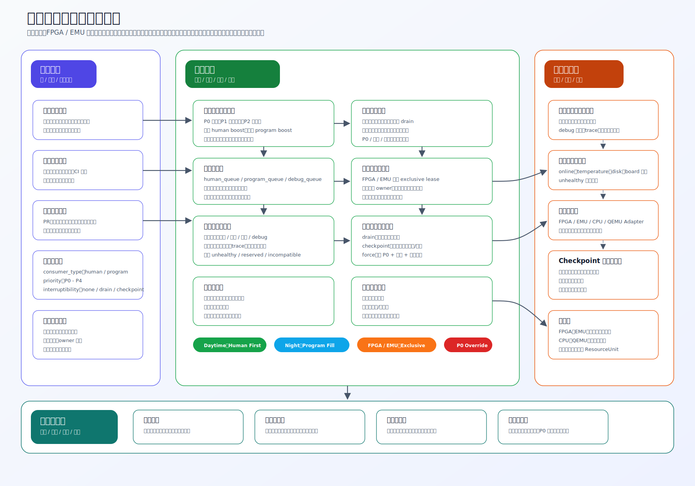

资源管理与调度模块负责把 FPGA、EMU、CPU Farm、QEMU+cmodel、QEMU+amodel 统一纳管，并在“人”和“程序”之间做可解释、可中断、可审计的分配。

关键设计：

- **统一入口**：Jenkins、人工、里程碑、Agent 任务统一走 `ResourceRequest -> ResourceLease -> labgrid`，不能绕过调度层直接访问 labgrid。
- **注入排队**：外部请求可以指定资源类型、资源池、place、期望时长和 deadline；调度层先入队，再根据策略匹配资源。
- **优先级队列**：P0 投片阻塞、P1 高风险定位、里程碑任务、夜间回归、普通任务有明确排序，并支持等待老化和资源稀缺加权。
- **插队与抢占**：高优先级请求可以插队；抢占低优先级租约时必须进入 drain / checkpoint / approval / force 流程。
- **Kill / reset / release**：强制抢占不是只改状态，必须按资源策略终止当前任务，执行 reset / release / cleanup，并把损失和证据写入审计。
- **不可虚拟化设备**：FPGA / EMU 默认不能虚拟化，必须通过独占租约避免冲突。
- **labgrid 边界**：labgrid 负责设备注册、状态、place acquire/release 和 host 控制脚本；业务排队、优先级、抢占审批、占用 metadata 和 UI 解释由调度层负责。
- **人和程序共享**：人工调试、自动回归、CI、Agent 任务都走 `ResourceRequest`。
- **昼夜策略**：白天 `Human First`，夜间 `Program Fill`，P0 可覆盖但不能跳过审计。

> 上面的二级架构是概念模型。4.2 给出本期落地的具体形态：在现有 labgrid 设备锁之上新增一层硬件调度层，实现注入排队、优先级队列、插队与抢占。

### 4.2 基于 labgrid 的硬件调度层

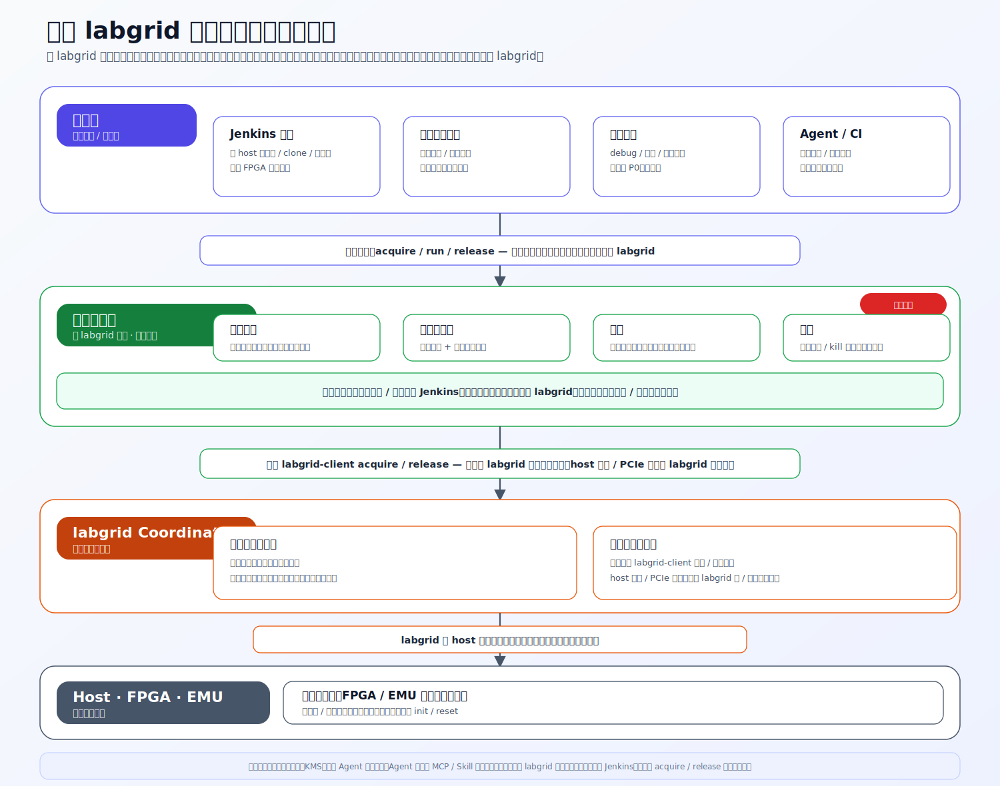

现有芯片部门的 FPGA / EMU 测试通过 Jenkins 在指定 host 上拉文件、clone 代码、执行脚本完成，并已通过 labgrid Coordinator 实现 FPGA 设备的 acquire / release 锁。但 labgrid 只提供「裸锁」——谁先抢到谁用，没有排队、优先级、插队和抢占。本期在 labgrid 之上新增一层**硬件调度层**，把多人 / 多程序对稀缺设备的争用升级为可调度的资源分配。

#### 4.2.1 分层与单一入口

分层自上而下为：消费者 → 硬件调度层 → labgrid Coordinator → Host / FPGA / EMU 硬件。

- **消费者**：Jenkins 触发、里程碑执行器、人工调试、Agent / CI，统一以 `ResourceRequest` 提交。
- **硬件调度层（本期新增）**：在 labgrid 之上，负责排队、优先级、插队、抢占。
- **labgrid Coordinator**：底层设备状态注册表。
- **硬件**：FPGA / EMU 等真实物理设备。

**单一入口约束**：所有资源操作（acquire / run / release）必须经过硬件调度层。任何人 / 程序，**包括 Jenkins**，都不得绕过调度层直接写 labgrid，否则会出现两处同时持锁 / 释放的不一致。Jenkins 本期仍是实际执行器，但其资源 acquire / release 必须改走调度层接口。

现有 Jenkins 执行路径可以作为调度层下游执行面复用：Jenkins Controller 将测试阶段调度到目标 Host Agent，Host 拉取 artifact、clone 测试和 debug 仓库、执行 FPGA release / load 脚本、运行 `run_test.sh` / pytest，并在结束时归档 allure / logs。调度层只接管“何时允许占用硬件、如何排队 / 插队 / 抢占、何时 acquire / release labgrid place”这些资源决策。

#### 4.2.2 labgrid 的角色边界

labgrid 只维护「设备状态注册表」——有哪些设备、当前是否被占用；它**不做调度，也不关心是谁在占用、为什么占用**。硬件调度层在 labgrid 之上封装 acquire / release（对应 `labgrid-client acquire / release`），但**不关心 labgrid 如何实际操作硬件**（host 脚本、PCIe 控制等），这些仍由 labgrid 侧 / 芯片团队负责。这样调度层可以聚焦在「争用与公平」，不被底层硬件操作细节拖住。

#### 4.2.3 四个核心能力

| 能力 | 语义 |
| --- | --- |
| **注入排队** | 所有资源请求统一进入调度层排队，按资源类型 / 项目分片，避免裸锁下「谁先抢到谁用」。 |
| **优先级队列** | 请求携带优先级，调度层计算 `effectiveScore` 动态排序（见二级文档评分模型）。 |
| **插队** | 高优先级请求插到队前，优先获得下一个释放的资源——决定「下一个空出来给谁」。 |
| **抢占** | 当稀缺设备被低价值任务占用时，高优先级请求可强制释放 / kill 占用者并把设备交给高优先级请求——决定「正在跑的要不要让出来」。 |

插队解决「排到队前」，抢占解决「踢掉占用者」；二者都受最小优先级差与审批约束。

#### 4.2.4 优先级阶梯

落到本场景的具体排序（与 `PriorityClass` 对齐）：

| 来源 | 默认优先级 | 说明 |
| --- | --- | --- |
| 人工调试 / 复现 | P0 | 白天默认最高，可触发对低优先级程序任务的抢占 |
| 里程碑 / 批量回归 | P1 - P2 | 夜间 `Program Fill` 填充 FPGA / EMU |
| Agent 改代码 / 后台探索 | P3 - P4 | 低优先级长任务，可被抢占 / 延后 |

#### 4.2.5 调度接口

调度层向消费者暴露 acquire → run → release（即 init / run / de-init）语义。消费者申请后，调度层要么**发放租约**（附带使用期限与续约），要么告知「被占用，预计等待 X」。抢占释放后，设备环境可能需要重新 init / reset（见 4.3 中断语义中的 `FORCE`）。

#### 4.2.6 边界：纯基建，与 Agent 平台解耦

硬件调度层是**纯基础设施能力**，不与 Agent 平台耦合。Agent 平台通过 MCP / Skill 向调度层申请资源，而不是直接持有 labgrid 句柄。第一版交付后由运维接管。

#### 4.2.7 待确认 / 风险项

- **接口同步 vs 异步**：决定里程碑执行器等上层如何驱动调度层（一次性提交全部并轮询，还是先锁后跑再释放）。需 owner 定型，并直接影响上层调度实现。
- **环境物料是否 ready**：批量测试时编译产物是否已在 host 上就绪（简单 init / run / de-init），还是仍需一套复杂编译 / reset 流程。当前方向是批量应 ready、仅版本跳变时重新 init，需与芯片团队确认——该点直接决定抢占后「kill + 重新 init」的成本与语义。
- **kill 权限**：抢占需要调度层具备强制终止占用任务的能力（权限与现场保护），需明确授权范围。

### 4.3 状态机

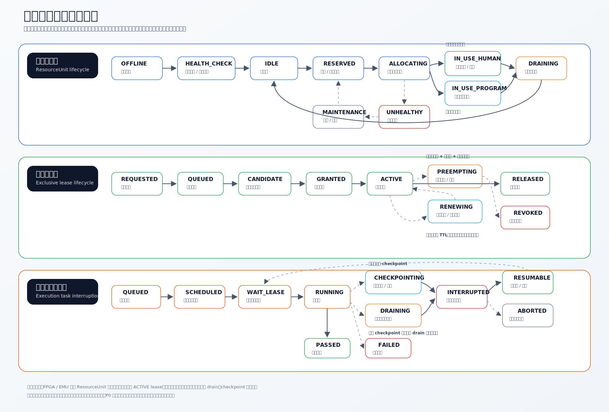

中断语义：

| 类型           | 语义                                  | 适用场景                           |
| -------------- | ------------------------------------- | ---------------------------------- |
| `DRAIN`      | 不接新阶段，运行到安全退出点后释放    | 长回归、阶段性测试                 |
| `CHECKPOINT` | 保存现场、进度、命令、artifact 后释放 | 可恢复任务、QEMU/CPU/部分 EMU 流程 |
| `MIGRATE`    | checkpoint 后换资源继续               | CPU/QEMU 或兼容资源                |
| `FORCE`      | 强制终止                              | 只允许 P0 + 审批 + 现场保护        |

FPGA/EMU 如果正在人工 debug 或失败现场保护，默认不抢占，除非 owner 释放或审批通过。`FORCE`（强制终止）即 4.2 中抢占所用的 kill：需权限与审批，且释放后 FPGA / EMU 环境通常要重新 init / reset，尤其是被人工打断破坏了既有物料环境时。

### 4.4 资源可视化

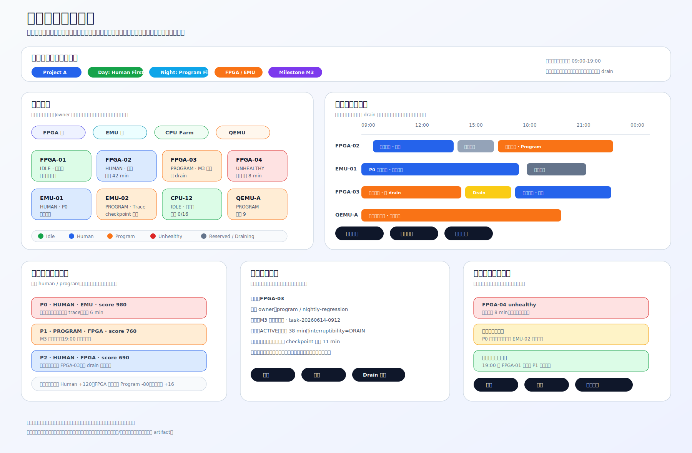

资源页面需要支持：

- 资源地图：按 FPGA、EMU、CPU、QEMU 展示状态、owner、租约和健康。
- 时间线：展示预约、占用、夜间计划、maintenance、drain、health outage。
- 队列视图：展示 `effectiveScore`、优先级、等待时间和等待原因。
- 租约详情：续约、释放、抢占、drain、现场保护。
- 调度解释：展示命中规则、分数明细、候选资源和拒绝原因。
- 审批中心：处理抢占、强制释放和危险操作。

## 5. 用例执行编排

> 详细设计：`use-case-execution-orchestration.md`
>
> 数据模型：`use-case-execution-data-model.md`

### 5.1 二级架构

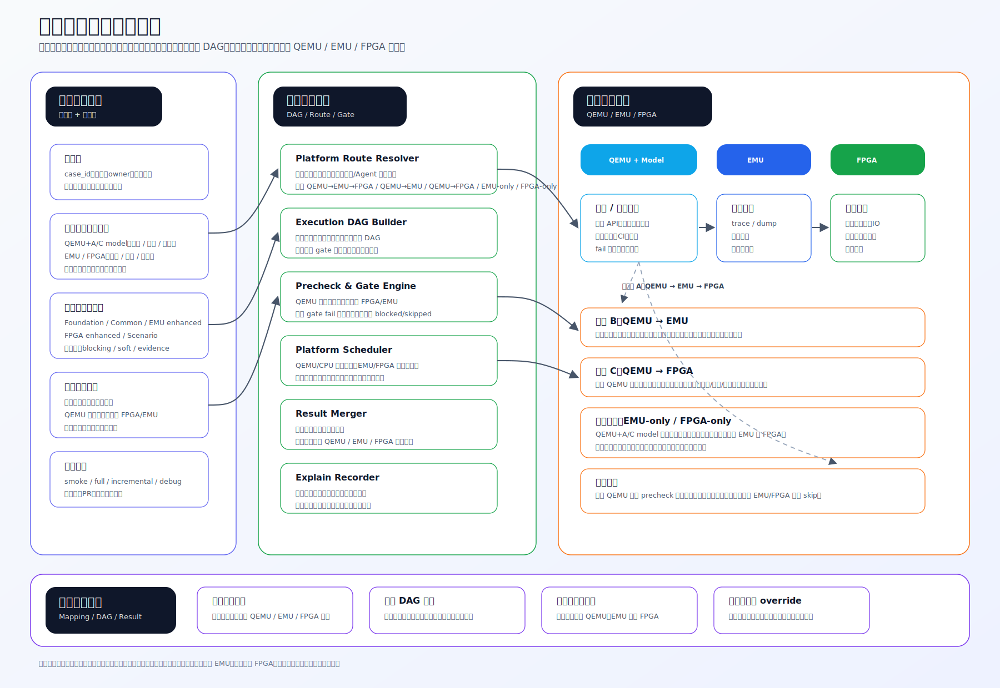

用例执行模块的核心对象是 `ExecutionGraph`。它不是一个线性执行队列，而是从执行计划、人工平台标注、用例依赖和失败 gate 规则生成的运行时 DAG 快照。模块先回答四个问题：

1. 一个用例在哪些平台执行。
2. 各平台按什么顺序执行。
3. 失败后是否继续。
4. 最终结论来自哪个平台。

这些答案固化到执行图里。一个用例在一个平台上的一次执行会成为一个 `CaseExecutionNode`；节点之间的边表达同用例平台顺序、跨用例依赖、gate 阻断和证据关系。执行计划启动后，执行图就是这次执行的事实来源，后续平台标注或依赖调整应生成新的图版本，不能静默改写正在运行的图。

执行驱动器位于执行图和资源之间，只承担两件事：监控资源状态，遍历执行图。它从图里找到依赖已释放、状态为 `READY`、且资源条件满足的节点，然后把任务下发到对应资源的执行入口。平台选择、失败 gate、用例优先级和资源分配策略都不在执行驱动器里做。

用例优先级涵盖：

- 领域间依赖
- 模块间依赖
- 用例优先级（ P0\P1\... ）

平台路线不能固定为一条。系统支持：

- `QEMU -> EMU -> FPGA`
- `QEMU -> EMU`
- `QEMU -> FPGA`
- `EMU-only`
- `FPGA-only`
- `QEMU-only`

### 5.2 执行图与节点状态机

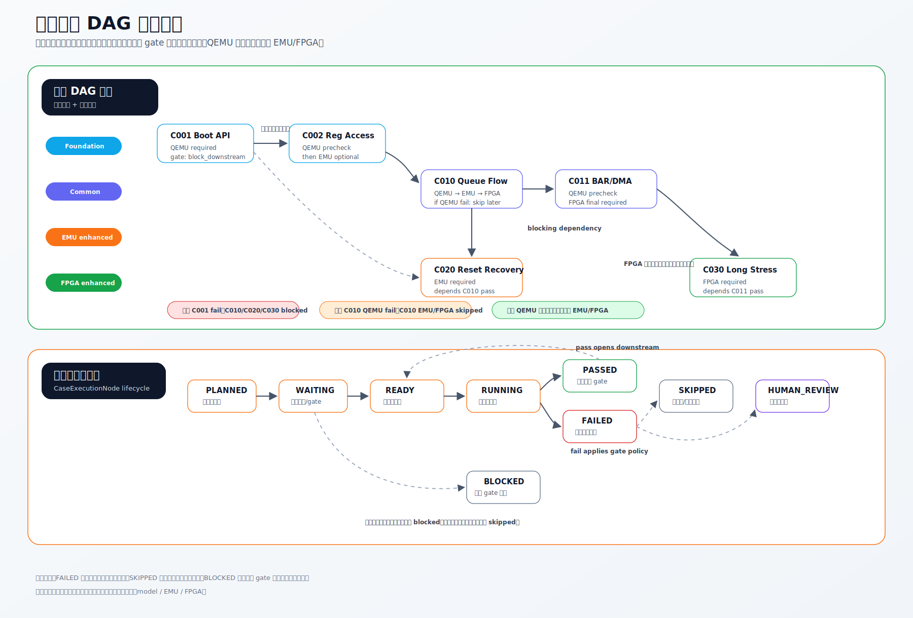

核心规则：

- 平台归属由人标注，Agent 可建议但不能无痕覆盖。
- `ExecutionGraph` 是平台节点组成的 DAG，不是简单用例列表。
- `CaseExecutionNode` 的状态推进必须由依赖边、gate 策略、资源状态和执行结果共同驱动。
- 基础 gate 失败后，下游 blocking 节点进入 `BLOCKED`。
- QEMU 作为 `PRECHECK` 失败后，后续 EMU/FPGA 节点可进入 `SKIPPED`。
- QEMU `model_unsupported` 不能当成真实失败，应转入 EMU/FPGA 或人工审核。
- 最终报告必须说明结论来源是 QEMU、EMU、FPGA 还是人工审核。

### 5.3 执行驱动器与资源下发

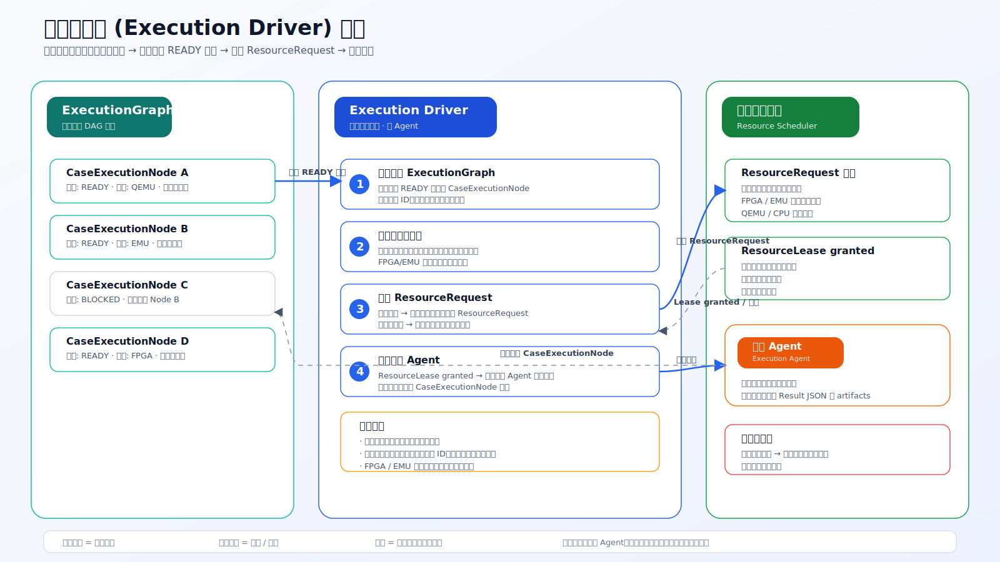

执行驱动器是用例执行编排内部的确定性后台组件。它不是 Agent，不选择用例、不决定资源策略、不执行脚本；它只监控资源状态并遍历 `ExecutionGraph`，把已经具备执行条件的 `CaseExecutionNode` 下发成具体执行任务。

一个节点要被驱动器下发，必须同时满足四个条件：

1. 节点状态为 `READY`，且没有未完成的幂等下发记录。
2. 所有 blocking 依赖和平台顺序依赖已经释放。
3. 节点没有被 QEMU precheck、基础 gate 或人工审核规则转成 `SKIPPED` / `BLOCKED` / `HUMAN_REVIEW`。
4. 所需资源类型已有可用资源或已获得资源调度模块确认的 `ResourceLease`。

资源调度模块仍然是资源状态、优先级、抢占、预约和独占租约的权威来源。执行驱动器只消费资源状态和租约结果，不在本地重新实现调度算法。

核心链路：

```text
ExecutionGraph + Resource State / ResourceLease
  -> ExecutionDriver 遍历 READY 节点
  -> 识别可执行 CaseExecutionNode
  -> 必要时发起 ResourceRequest
  -> ResourceLease confirmed
  -> 下发 ExecutionTask 到对应资源执行入口
  -> 执行 Agent / Worker 执行用例
  -> Result JSON / artifact 索引 / 节点状态回写
```

边界约束：

- 执行驱动器只做资源监控、图遍历和任务下发，不参与业务决策。
- 资源不可用或租约未确认时，节点保持 `READY` 等待，并记录等待原因和等待时长。
- 资源调度模块返回租约、抢占、释放或拒绝结果后，执行驱动器重新遍历图并评估等待节点。
- 执行驱动器不绕过资源调度模块直接分配资源。
- 每次下发必须记录触发时间、节点 ID、资源需求、资源/租约来源、等待原因和幂等键。
- FPGA / EMU 节点必须经过资源调度模块的独占租约确认，不能只因为图节点 `READY` 就直接启动执行。

### 5.4 里程碑执行阶段待确认问题

- 执行测试的流程是直接在qume、fgpa上执行测试命令？还是存在复杂的类jinkens 测试流水线？
- 执行测试的命令目前在tst仓，是否后续同步到平台进行登记？

## 6. 用例失败分析 Issue/PR 闭环

> 详细设计：`failure-analysis-issue-pr.md`
>
> 数据模型：`failure-analysis-issue-pr-data-model.md`

### 6.1 架构

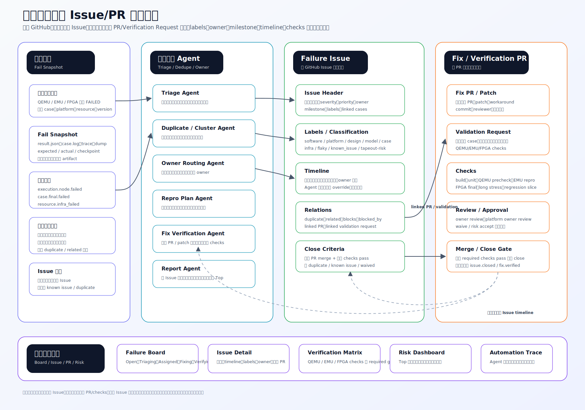

失败分析参考 GitHub Issue 和 PR 的协作模型：

- `FailureIssue` 像 GitHub Issue：title、status、severity、priority、owner、milestone、labels、timeline、duplicate、related、close criteria。
- `FixProposal` / `External PR` 像 GitHub PR：代码修复、配置修复、用例修复、平台修复、workaround、waiver。
- `VerificationCheck` 像 PR checks：QEMU、EMU、FPGA、CI、长稳、回归切片。
- `CloseGateEvaluation` 像 merge gate：证据、checks、owner、风险接受共同决定是否能关闭。

### 6.2 状态机

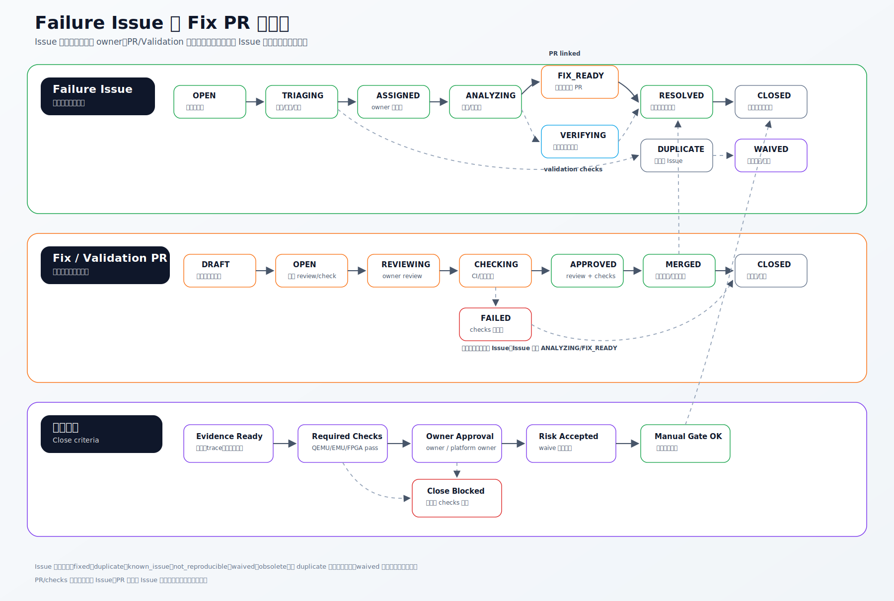

推荐流程：

1. `CaseExecutionNode` 失败，生成 `FailSnapshot`。
2. `fail_snapshot.created` 触发 Triage Agent。
3. Duplicate / Cluster Agent 判断是否追加到已有 Failure Issue。
4. 新失败创建 Failure Issue，自动打标签、分级、推荐 owner。
5. Owner 确认后进入分析，生成复现计划或定位计划。
6. 修复产生 FixProposal 或关联外部 PR。
7. Fix Verification Agent 生成 VerificationPlan 和 required checks。
8. QEMU/EMU/FPGA 验证结果回写 Issue timeline。
9. Close Gate Agent 评估是否允许关闭。
10. 满足证据和 checks 后关闭；否则回到分析或修复状态。

关闭 resolution：

| Resolution           | 必要条件                                                                        |
| -------------------- | ------------------------------------------------------------------------------- |
| `fixed`            | 修复 PR merged 或 fix proposal approved；required checks passed；owner approved |
| `duplicate`        | 有主 Issue 链接                                                                 |
| `known_issue`      | 有已知问题链接和影响范围                                                        |
| `waived`           | 有风险接受审批                                                                  |
| `not_reproducible` | 多次复跑不复现且保存证据                                                        |
| `obsolete`         | 版本或用例已废弃，有变更证据                                                    |

## 7. Agent 触发、运行记录与审计

> 详细设计：`automation-orchestration.md`
>
> 数据模型：`automation-orchestration-data-model.md`

### 7.1 定位

这不是独立业务编排层，也不负责决定异常处理、用例执行、资源分配或 Issue 流程怎么走。业务流程归属各业务模块；这里仅提供一层很薄的 Agent 运行支撑能力。

当业务模块按固定规则需要触发 Agent 时，Agent Runtime 负责启动、幂等、上下文装载、权限检查、运行记录、超时重试和审计。典型链路如下：

```text
业务对象状态变化
  -> 业务模块固定规则命中
  -> AgentRun
  -> Agent Output
  -> 回写业务对象 / 产生后续事件
```

例如 `fail_snapshot.created` 之后，失败分析流程本身仍属于第 6 节的 Issue/PR 闭环；本节只记录 Triage Agent 为什么被拉起、读取了哪些上下文、输出了什么证据、是否触发了危险动作审批。

### 7.2 运行约束

核心约束：

- Agent 触发来自业务模块的固定规则，不由这里重新决定业务流程。
- 同一个业务事件、同一个 Agent 目标必须有幂等键，避免重复运行。
- 每次 AgentRun 必须记录 Agent 版本、输入上下文、工具调用、输出证据和状态回写对象。
- 危险动作必须进入权限检查或人工审批，例如资源强制释放、自动关闭 Issue、修改准入结论。
- AgentRun 失败、超时或被取消时，只能按业务模块定义的补偿策略处理。
- 执行驱动器不进入 AgentRun 链路；它属于用例执行编排内部的确定性下发组件。

## 8. 跨模块协议

### 8.1 Event Schema

所有事件必须包含：

| 字段                              | 说明                                     |
| --------------------------------- | ---------------------------------------- |
| `event_id`                      | 全局唯一事件 ID                          |
| `event_type`                    | 事件类型，例如 `execution.node.failed` |
| `source`                        | 事件来源模块                             |
| `occurred_at`                   | 事件发生时间                             |
| `trace_id`                      | 跨模块追踪 ID                            |
| `idempotency_key`               | 幂等键                                   |
| `subject_type` / `subject_id` | 事件主体                                 |
| `payload_version`               | payload 版本                             |
| `payload`                       | 结构化事件内容                           |

典型事件：

```text
requirement.changed
case.updated
resource.heartbeat
resource.lease.expiring
plan.created
execution.node.failed
fail_snapshot.created
failure_issue.opened
fix_proposal.opened
verification_plan.completed
pr.updated
agent.completed
milestone.risk.changed
```

### 8.2 Result JSON

每次执行必须输出统一结果结构：

```json
{
  "task_id": "task-001",
  "case_id": "case-boot-api",
  "execution_node_id": "node-001",
  "platform": "QEMU_CMODEL",
  "resource_id": "qemu-pool-a",
  "version_matrix_id": "vm-2026-06-14-nightly",
  "stage": "run",
  "checkpoint": "after_boot",
  "result": "fail",
  "reason": "assertion mismatch",
  "expected": "doorbell=1",
  "actual": "doorbell=0",
  "artifact_refs": ["s3://catp/logs/task-001/case.log"],
  "repro_command": "./run_case.sh --case boot-api --seed 42"
}
```

结果状态至少支持：

```text
pass / fail / skip / blocked / timeout / infra_fail / model_unsupported
```

### 8.3 Version Matrix

每次执行必须绑定：

- RTL / IP / SoC 版本。
- FPGA bitstream。
- EMU build。
- QEMU、cmodel、amodel 版本。
- firmware、driver、runtime、compiler。
- test case、脚本、配置文件版本。

版本矩阵用于判断失败是否由版本变化引入，也用于增量回归选择和修复验证。

### 8.4 Resource Lease

FPGA / EMU 的资源租约必须包含：

- resource unit。
- labgrid place、coordinator、host 或等价 backend handle。
- owner 和 consumer type。
- source system：Jenkins、人工、里程碑执行器、Agent 等。
- priority。
- lease TTL 和续约状态。
- interruptibility。
- checkpoint / drain 能力。
- queue position、effective score、插队或抢占原因。
- 当前任务、计划、用例、版本矩阵。
- kill / reset / release / cleanup 策略和执行结果。
- 调度决策理由。
- 审批和人工 override 记录。

### 8.5 Agent Output

Agent 输出必须结构化：

| 字段                      | 说明                                   |
| ------------------------- | -------------------------------------- |
| `summary`               | 结论摘要                               |
| `confidence`            | 置信度                                 |
| `evidenceRefs`          | 日志、trace、Issue、PR、规则命中等证据 |
| `recommendedActions`    | 建议动作                               |
| `requiresHumanApproval` | 是否需要人工确认                       |
| `emittedEvents`         | 后续事件                               |

高风险动作必须由 Result Committer 或业务模块根据权限和审批策略提交，Agent 不能直接绕过平台写核心状态。

## 9. 可视化总设计

最终平台至少需要以下可视化页面。

### 9.1 总 Dashboard

面向验证负责人：

- 里程碑准入状态。
- 需求覆盖率、用例通过率、阻塞 Issue。
- 夜间计划完成度、失败趋势、资源利用率。
- 投片风险 Top、需要人工决策项。

### 9.2 资源可视化

面向资源管理员和 Owner：

- FPGA / EMU / CPU / QEMU 资源地图。
- 昼夜策略命中情况。
- 当前租约、剩余时间、是否可抢占。
- 队列分数和等待原因。
- 健康状态、隔离原因、下一个预约窗口。

### 9.3 用例执行视图

面向用例 Owner：

- 平台映射矩阵：用例 x QEMU/EMU/FPGA。
- 执行 DAG：平台节点、依赖边、gate、状态、跳过原因。
- 跨平台结果矩阵：结果来源、最终结论、风险说明。

### 9.4 Failure Board

面向失败分析和修复闭环：

- Open / Triaging / Assigned / Analyzing / Fix Ready / Verifying / Resolved / Closed。
- Issue 详情：FailSnapshot、timeline、labels、owner、milestone、relations。
- PR/checks：FixProposal、VerificationPlan、QEMU/EMU/FPGA checks。
- Close Gate：是否允许关闭和阻塞原因。

### 9.5 Agent Studio

面向 Agent 开发和平台治理：

- Agent Registry：模板、版本、owner、能力声明。
- MCP 管理：Server、Tool、授权、健康状态。
- Skill 管理：包、参数、依赖、评审、发布。
- Subagent 管理：角色、上下文边界、协作拓扑。
- Agent Run Trace：prompt、tool call、成本、耗时、输出质量。
- 权限和审批：危险动作、Secret、人工 override。

## 10. 关键闭环

### 10.1 夜间无人值守回归

```text
night_schedule.created
  -> 规则命中夜间计划 Agent
  -> 生成 ExecutionPlan
  -> 生成 ExecutionGraph
  -> QEMU/CPU 快速填充
  -> FPGA/EMU Program Fill
  -> Result JSON 和 artifacts 归档
  -> 失败进入 Failure Issue
  -> Report Agent 输出夜间摘要
```

### 10.2 PR 触发增量回归

```text
pr.updated / build.completed
  -> 变更影响 Agent
  -> 影响需求、模块、用例、平台
  -> 生成增量 ExecutionPlan
  -> QEMU 预筛
  -> 高风险升级 EMU/FPGA
  -> VerificationCheck 回写 PR 和 FailureIssue
```

### 10.3 失败分析与修复验证

```text
execution.node.failed
  -> FailSnapshot
  -> Triage Agent
  -> Duplicate / Cluster Agent
  -> FailureIssue
  -> Owner Routing
  -> Repro Plan / FixProposal
  -> VerificationPlan
  -> QEMU/EMU/FPGA checks
  -> CloseGateEvaluation
```

### 10.4 人工资源调试

```text
human.resource.requested
  -> ResourceRequest
  -> 白天 Human First 策略加权
  -> 检查 FPGA/EMU 独占租约
  -> 必要时触发 drain / checkpoint / approval
  -> ResourceLease granted
  -> Dashboard 展示 owner、TTL、现场保护
```

### 10.5 Jenkins 硬件测试接入

```text
jenkins.test_stage.requested
  -> Hardware Scheduler acquire(resource, priority, duration, metadata)
  -> ResourceRequest(sourceSystem=Jenkins)
  -> 优先级队列 / 预约窗口 / 抢占检查
  -> ResourceLease granted
  -> Scheduler acquire labgrid place
  -> Jenkins Host Agent 拉取 artifact、clone 代码、执行 FPGA load 和 run_test.sh
  -> Result JSON / allure / logs 归档
  -> Scheduler release labgrid place and ResourceLease
```

Jenkins 仍然负责构建、拉取文件、在指定 Host 上执行既有脚本和归档报告；硬件调度层负责“谁能用这块硬件、什么时候用、是否能插队或抢占、如何释放和审计”。这样可以避免 Jenkins、人工 debug 和新平台同时直接操作 labgrid 造成资源状态分裂。

## 11. 模块交付边界

第一版优先把状态、事件、结果协议和资源锁做扎实。建议分阶段落地：

| 阶段 | 目标                   | 关键产出                                                                 |
| ---- | ---------------------- | ------------------------------------------------------------------------ |
| P0   | 数据主干和基础执行闭环 | 资源登记、用例管理、计划任务、Result JSON、artifact 归档、基础 Dashboard |
| P1   | 可用的调度和夜间自动化 | 资源租约、昼夜策略、任务队列、夜间执行、失败复跑、资源 unhealthy 隔离    |
| P2   | Agent Runtime 与治理   | Agent Registry、MCP/Skill/Subagent 管理、Agent Runtime、Trace 审计       |
| P3   | 智能化失败闭环         | 失败聚类、Issue/PR 闭环、修复验证 checks、Close Gate                     |
| P4   | 增量回归和投片准入     | PR 影响分析、用例选择 Agent、里程碑门禁、风险预测                        |

## 12. 设计约束清单

- 平台必须以业务对象为中心，Agent 是执行能力，不是状态真相来源。
- 所有 Agent 自动触发必须有业务事件或状态变化、固定规则、Agent 版本、输入上下文、输出证据和审计记录。
- 所有硬件资源入口必须先经过 Hardware Scheduler，再访问 labgrid；Jenkins 不能继续绕过调度层直接持有 labgrid 决策权。
- labgrid 是底层 place 锁、状态和 host 控制脚本接口，不承载业务优先级、排队、插队、抢占审批或占用 metadata。
- FPGA / EMU 不可虚拟化，默认独占租约。
- 白天优先人工，夜间优先程序，但 P0、预约、现场保护和审批可覆盖默认策略。
- 用例平台归属由人标注，Agent 只能建议。
- QEMU precheck fail 可以跳过后续 FPGA/EMU；model unsupported 不能当作真实失败。
- 基础 gate 失败可以阻断下游 DAG 节点。
- 失败先形成 FailSnapshot，再进入 Issue/PR 闭环。
- Issue 关闭必须有证据门禁，不能只靠口头确认。
- Agent 运行必须有幂等键；同一业务事件和同一业务目标不能重复拉起等价 AgentRun。
- Artifact 大文件存 S3 / MinIO，索引和状态存 SQL。
- Version Matrix 是执行、复跑、归因、增量回归和修复验证的共同基础。

## 13. 子文档索引

| 子文档                                         | 内容                                                                           |
| ---------------------------------------------- | ------------------------------------------------------------------------------ |
| `chip-validation-platform-layered.md`        | 五层分层架构                                                                   |
| `chip-validation-platform-module-details.md` | 每个模块职责、输入、输出和关键设计点                                           |
| `resource-management-scheduling.md`          | 资源管理与调度二级架构、状态机、可视化                                         |
| `resource-management-data-model.md`          | 资源、请求、租约、调度策略、中断、可视化数据模型                               |
| `automation-orchestration.md`                | Agent 触发、运行记录与审计设计                                                 |
| `automation-orchestration-data-model.md`     | Event、固定规则、AgentRun、ToolCall、Action 数据模型                           |
| `use-case-execution-orchestration.md`        | 用例执行平台路线、DAG、QEMU precheck、基础 gate                                |
| `execution-driver-architecture.svg`          | 执行驱动器架构图：监控资源状态 → 遍历 READY 节点 → 下发任务到对应资源        |
| `use-case-execution-data-model.md`           | TestCase、平台标注、ExecutionGraph、CaseNode、Result 数据模型                  |
| `failure-analysis-issue-pr.md`               | 类 GitHub Issue/PR 的失败分析闭环                                              |
| `failure-analysis-issue-pr-data-model.md`    | FailSnapshot、FailureIssue、FixProposal、VerificationCheck、CloseGate 数据模型 |

## 14. 最终结论

该设计把芯片软件验证平台拆成五层：基础资源与存储、平台组件与能力、业务管理与业务规则、明确目的的 Agent、展示与协同。业务模块负责沉淀真实状态和固定规则，Agent Runtime 负责运行记录与审计，资源调度模块负责稀缺硬件的可解释分配，用例执行模块负责多平台 ExecutionGraph 编排和执行驱动器下发，失败分析模块负责把失败转成类似 GitHub Issue/PR 的可闭环工程对象。

最终平台应优先保证四件事：状态可信、资源可控、证据完整、自动化可解释。智能 Agent 能力在这个基础上逐步增强，才不会变成黑盒流程。
