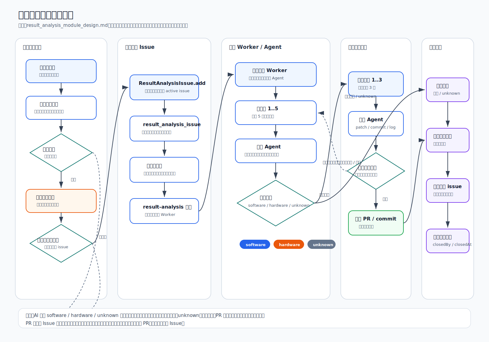
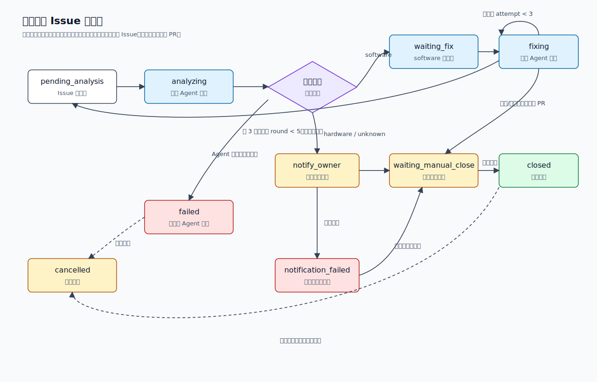
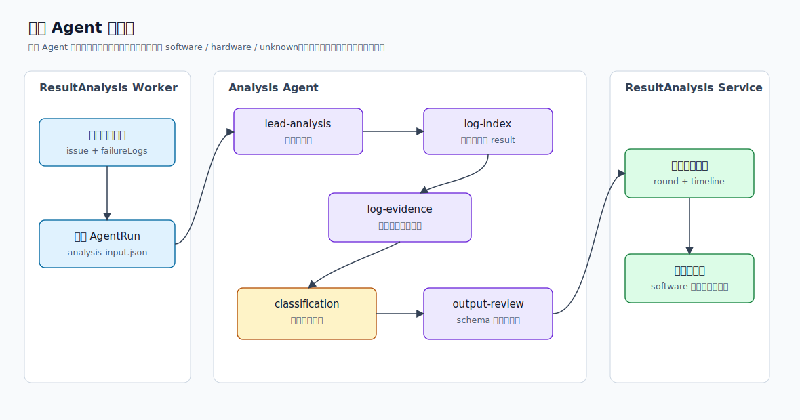
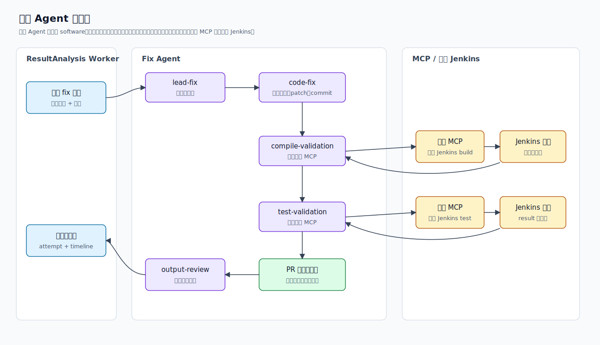
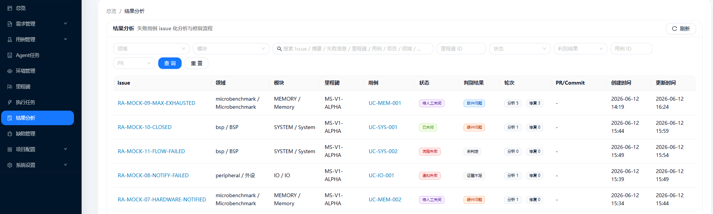
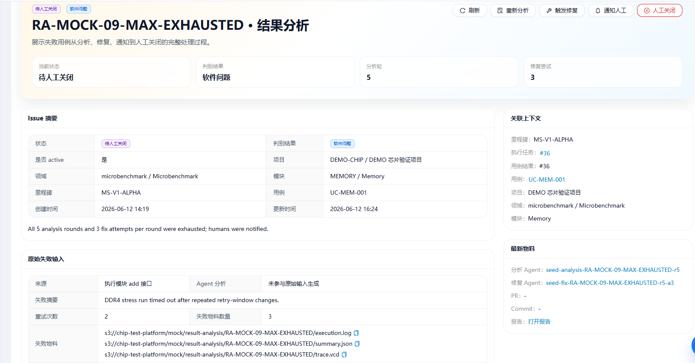
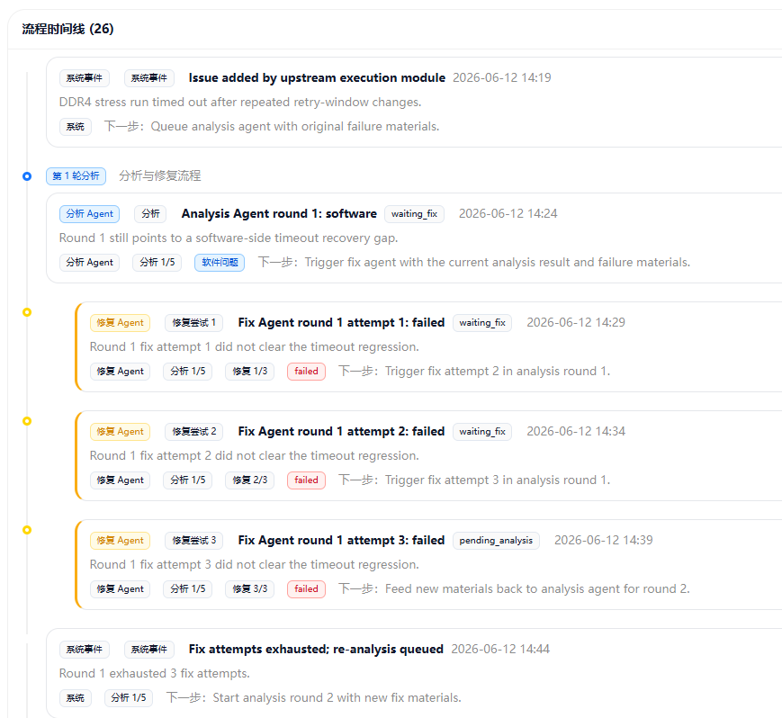

# 结果分析模块详细设计

## 1. 总体架构



整体链路：

```text
用例执行模块
  -> 失败后执行模块完成自身重试
  -> POST /api/result-analysis/issues
  -> ResultAnalysisIssue pending_analysis
  -> result-analysis 队列
  -> 分析 Agent
  -> software / hardware / unknown
  -> software: 修复 Agent 1..3 次，修复后调用编译 MCP/测试 MCP 触发芯片 Jenkins 验证
  -> 修复失败物料回灌，最多 5 轮分析
  -> hardware / unknown / 达到上限: 通知人工
  -> waiting_manual_close
  -> 人工关闭 issue
```

模块边界：

| 模块 | 职责 | 不负责 |
| --- | --- | --- |
| 用例执行模块 | 执行、重试、保存 `execution_case_result`、上传日志包、调用结果分析输入接口 | 不做长期 issue 生命周期管理，不调修复 Agent |
| 结果分析 API | 创建、查询、关闭 issue，提供操作接口，校验状态机 | 不直接执行 Agent 逻辑 |
| 结果分析 Worker | 消费队列、构造 Agent 输入、调用 Agent 平台、写回结构化结果 | 不绕过 API 或事务改核心状态 |
| 分析 Agent | 分析失败日志或修复失败日志，输出三类结论和证据 | 不修改代码，不关闭 issue |
| 修复 Agent | 只在 software 路径下尝试最小代码修复，调用编译 MCP 和测试 MCP，生成 patch、commit、PR 信息和验证结果 | 不处理 hardware/unknown，不自动合并 PR |
| 通知流程 | 根据结论和状态通知 owner 或群组，并追加时间线记录 | 不代替人工关闭 |
| 人工关闭 | 人确认证据、填写关闭原因并关闭 issue | 不由 Agent 自动触发 |

关键约束：

- 一条最终失败的 `execution_case_result` 对应一条 active 结果分析 issue。
- 分析结论只保留 `software`、`hardware`、`unknown` 三类。
- `hardware` 和 `unknown` 必须人工介入确认，不进入修复 Agent。
- PR 合入和 issue 关闭都必须人工最终把关，系统不自动合并 PR，也不自动关闭 issue。

## 2. 模块输入

结果分析模块的入口输入来自用例执行模块。用例执行模块只在确认某条用例结果最终失败，且已经完成自身重试策略后调用。

接口：`POST /api/result-analysis/issues`

请求样式以 `result-analysis-add-api-contract.md` 为准：

```json
{
  "requestId": "ra-add-ecr-3001",
  "executionCaseResultId": "3001",
  "executionTaskId": "2001",
  "milestoneId": "1001",
  "projectId": "10",
  "moduleId": "21",
  "useCaseId": "501",
  "failureSummary": "boot_api 在 doorbell 检查点失败，重试 2 次仍失败",
  "finalStatus": "failed",
  "retryCount": 2,
  "blockingMilestone": true,
  "executionContext": {
    "testCarrier": "qemu",
    "envType": "qemu",
    "startedAt": "2026-06-16T09:50:00+08:00",
    "endedAt": "2026-06-16T10:12:00+08:00",
    "durationMs": 1320000,
    "reproduceCommand": "./run_case.sh --case boot_api --env qemu --seed 42 --image image-20260616"
  },
  "codeContext": {
    "repositories": [
      {
        "repoUrl": "git@gitlab.example.com:chip/firmware.git",
        "branch": "feature/boot-doorbell",
        "commitSha": "abc1234567890abcdef"
      }
    ]
  },
  "materials": {
    "knowledgePackageUri": "s3://catp/materials/ecr-3001/knowledge.zip",
    "logPackageUri": "s3://catp/materials/ecr-3001/logs.zip"
  }
}
```

字段约束：

| 字段 | 必填 | 说明 |
| --- | --- | --- |
| `requestId` | 是 | 请求幂等键，建议按 `executionCaseResultId` 生成 |
| `executionCaseResultId` | 是 | 结果分析 issue 的主来源 |
| `executionTaskId` | 是 | 用于回查任务、调度和 artifact |
| `milestoneId` | 是 | 里程碑过滤、统计和阻塞判断 |
| `projectId` | 是 | 项目维度过滤和权限上下文 |
| `moduleId` | 建议 | 模块维度过滤和 owner 路由 |
| `useCaseId` | 是 | 用例维度过滤和用例上下文反查 |
| `failureSummary` | 是 | issue 标题和列表摘要的主要来源 |
| `finalStatus` | 是 | 只接受 `failed`、`timeout`、`infra_failed` 等最终失败状态 |
| `retryCount` | 是 | 执行模块已完成的重试次数 |
| `blockingMilestone` | 建议 | 是否阻塞里程碑 |
| `executionContext.testCarrier` | 是 | 测试载体，例如 `qemu`、`emu`、`fpga`、`board` |
| `executionContext.envType` | 是 | 执行环境类型 |
| `executionContext.reproduceCommand` | 是 | 复现或执行命令 |
| `codeContext.repositories[].repoUrl` | 是 | Git clone 地址 |
| `codeContext.repositories[].branch` | 是 | 本次执行分支 |
| `codeContext.repositories[].commitSha` | 建议 | 精确 commit；没有时只能按分支头部分析 |
| `materials.logPackageUri` | 是 | 完整日志包，包含 result.json、case.log、trace、dump、waveform 等 |
| `materials.knowledgePackageUri` | 建议 | 知识包，包含设计文档、历史问题、规则说明等 |

## 3. 数据模型

`ResultAnalysisIssue`、`ResultAnalysisRound`、`ResultAnalysisFixAttempt`、`ResultAnalysisTimelineEvent`、`ResultAnalysisNotificationRule` 。

### ResultAnalysisIssue

issue 主表，承载当前状态和索引字段。

| 字段 | 说明 |
| --- | --- |
| `id` | 主键 |
| `issueKey` | 展示 key，例如 `RA-ECR-3001` |
| `activeFlag` | active issue 唯一约束标记 |
| `executionCaseResultId` | 主来源 ID，必填 |
| `executionTaskId` | 执行任务 ID，建议保存 |
| `milestoneId` | 里程碑 ID |
| `projectId` | 项目 ID |
| `moduleId` | 模块 ID |
| `useCaseId` | 用例 ID |
| `status` | issue 主状态 |
| `conclusionType` | `software`、`hardware`、`unknown` |
| `confidence` | 分析置信度 |
| `failureSummary` | 原始失败摘要 |
| `summary` | 当前分析摘要 |
| `retryCount` | 执行模块重试次数 |
| `blockingMilestone` | 是否阻塞里程碑 |
| `materialUrisJson` | 日志包、知识包、关键 artifact URI |
| `originalInputJson` | 保存模块输入和服务端反查快照 |
| `currentAnalysisRound` | 当前分析轮序号 |
| `currentFixAttempt` | 当前轮修复尝试序号 |
| `prUrl` | 修复 Agent 或人工登记的 PR 地址 |
| `prId` | 外部 PR ID |
| `commitSha` | 修复 commit |
| `patchUri` | 修复 patch 物料 URI |
| `notifiedAt` | 最近通知时间 |
| `closedBy` | 人工关闭人 |
| `closedAt` | 人工关闭时间 |
| `closeReason` | 人工关闭原因 |
| `createdBy` | 创建人或系统账号 |
| `updatedBy` | 最近更新人或系统账号 |
| `createdAt` | 创建时间 |
| `updatedAt` | 更新时间 |

### ResultAnalysisRound

每一轮分析 Agent 的输出记录。外层最多 5 轮。

| 字段 | 说明 |
| --- | --- |
| `id` | 主键 |
| `issueId` | 所属 issue |
| `roundNo` | 轮次，`1..5` |
| `status` | `pending`、`running`、`completed`、`failed` |
| `conclusionType` | 本轮结论：`software`、`hardware`、`unknown` |
| `confidence` | 本轮置信度 |
| `summary` | 本轮摘要 |
| `detailMd` | 本轮详细分析 Markdown |
| `evidenceJson` | 证据列表，必须引用失败日志、result.json 或修复失败日志 |
| `suspectedLocationsJson` | 可疑原因线索，例如软件行为异常、硬件响应异常、环境或日志不足，不要求代码位置 |
| `fixSuggestionsJson` | 给修复 Agent 的高层修复提示，仅 software 使用 |
| `inputSnapshotJson` | 本轮 Agent 输入快照 |
| `rawResultJson` | Agent 原始输出 |
| `platformTaskId` | Agent 平台任务 ID |
| `platformTaskUrl` | Agent 平台任务页面 |
| `inputObjectUri` | 输入对象存储 URI |
| `outputObjectUri` | 输出对象存储 URI |
| `errorMessage` | Agent 调用或解析错误 |
| `createdAt` | 创建时间 |
| `updatedAt` | 更新时间 |

### ResultAnalysisFixAttempt

软件问题路径下的修复尝试记录。每个分析轮最多 3 次。

| 字段 | 说明 |
| --- | --- |
| `id` | 主键 |
| `issueId` | 所属 issue |
| `roundId` | 所属分析轮 |
| `attemptNo` | 当前分析轮内序号，`1..3` |
| `status` | `pending`、`running`、`passed`、`failed` |
| `fixResult` | `passed`、`failed` |
| `summary` | 本次修复做了什么 |
| `modifiedFilesJson` | 修改文件列表 |
| `patchUri` | patch 物料 URI |
| `patchMd` | patch 摘要或内联 Markdown |
| `commitSha` | 修复 commit |
| `logsJson` | 编译、测试、Agent 运行日志 |
| `validationJson` | 编译 MCP、测试 MCP、Jenkins job URL、状态、artifact URI、log URI、耗时和失败摘要 |
| `failureSummary` | 本次修复后仍失败时的新失败摘要 |
| `newMaterialsJson` | 新增日志、patch、commit、失败物料 |
| `inputSnapshotJson` | Agent 输入快照 |
| `rawResultJson` | Agent 原始输出 |
| `platformTaskId` | Agent 平台任务 ID |
| `platformTaskUrl` | Agent 平台任务页面 |
| `errorMessage` | 调用或执行错误 |
| `createdAt` | 创建时间 |
| `updatedAt` | 更新时间 |

### ResultAnalysisTimelineEvent

issue 详情页的主展示对象。所有系统、Agent、通知、人工操作都追加为流程记录，不覆盖历史。

| 字段 | 说明 |
| --- | --- |
| `id` | 主键 |
| `issueId` | 所属 issue |
| `roundId` | 可选关联分析轮 |
| `fixAttemptId` | 可选关联修复尝试 |
| `eventType` | `analysis_result`、`fix_result`、`notification_sent`、`notification_failed`、`manual_close`、`system_event` |
| `actorType` | `system`、`analysis_agent`、`fix_agent`、`notification_agent`、`human` |
| `actorName` | 具体执行者 |
| `title` | 时间线标题 |
| `summary` | 时间线摘要 |
| `detailMd` | 时间线详情 Markdown |
| `structuredJson` | 结构化详情，供前端渲染证据卡片 |
| `artifactUrisJson` | 关联物料 |
| `idempotencyKey` | 流程记录幂等键 |
| `createdAt` | 创建时间 |

### ResultAnalysisNotificationRule

通知规则模型用于把不同项目、模块、结论和状态路由到对应 owner 或群组。

| 字段 | 说明 |
| --- | --- |
| `id` | 主键 |
| `projectId` | 适用项目；为空表示全局默认规则 |
| `moduleId` | 适用模块；为空表示项目级默认规则 |
| `conclusionType` | 适用结论：`software`、`hardware`、`unknown`；为空表示不限 |
| `issueStatus` | 适用 issue 状态，例如 `waiting_manual_close`、`notification_failed` |
| `triggerEvent` | 触发事件，例如 `analysis_completed`、`fix_limit_reached`、`pr_create_failed` |
| `receiverType` | `user`、`group`、`role`、`webhook` |
| `receiverConfigJson` | 接收人配置，例如用户 ID、群 ID、角色名、Webhook URL |
| `channel` | 通知渠道，例如站内信、邮件、IM、Webhook |
| `priority` | 规则优先级，数字越小优先级越高 |
| `enabled` | 是否启用 |
| `createdBy` | 创建人 |
| `updatedBy` | 最近更新人 |
| `createdAt` | 创建时间 |
| `updatedAt` | 更新时间 |

## 4. 状态机



建议主状态：

| 状态 | 含义 |
| --- | --- |
| `pending_analysis` | issue 已创建，等待分析 |
| `analyzing` | 分析 Agent 运行中 |
| `waiting_fix` | 分析结论为 software，等待启动修复 |
| `fixing` | 修复 Agent 运行中 |
| `waiting_manual_close` | 已有足够结果，等待人工关闭 |
| `notification_failed` | 通知发送失败，等待重发或人工确认 |
| `failed` | 系统异常导致流程失败，可重试或人工处理 |
| `closed` | 人工关闭 |
| `cancelled` | 人工取消 |

状态流转：

```text
pending_analysis -> analyzing
analyzing -> waiting_fix             结论 software
analyzing -> waiting_manual_close    结论 hardware/unknown 且通知已完成
analyzing -> failed                  Agent 失败或输出非法
waiting_fix -> fixing
fixing -> waiting_fix                本轮修复失败且 attempt < 3
fixing -> pending_analysis           本轮第 3 次修复失败且 round < 5，回灌新物料后进入下一轮分析
fixing -> waiting_manual_close       修复通过、编译/测试通过并创建 PR/登记 commit，或达到上限通知人工
waiting_manual_close -> closed       人工关闭
closed -> pending_analysis           人工重新打开
```

关键约束：

- 同一 issue 同一时间只允许一个 active workflow step。
- 同一分析轮只允许一个分析 Agent 任务。
- 同一修复尝试只允许一个修复 Agent 任务。
- 自动分析最多 5 轮；每轮自动修复最多 3 次。
- `hardware` 和 `unknown` 不进入修复 Agent。
- 修复通过只进入 `waiting_manual_close`，不自动关闭 issue。
- PR 合入必须由人完成；系统只记录 PR、commit、checks 和建议。

## 5. 分析 Agent 设计



分析 Agent 的职责应保持收敛：只基于失败日志做三分类判断。这里的失败日志可能来自两类场景：

- 第一次最终失败的用例日志，由用例执行模块上传。
- 修复 Agent 尝试修复后仍失败的编译日志或测试日志，由修复 Agent 回灌。

分析 Agent 不需要读取代码仓库，也不需要依赖知识包。代码修改由修复 Agent 负责；如果日志证据不足以支撑 `software` 或 `hardware`，应输出 `unknown` 并要求人工确认。

### 5.1 输入数据结构

结果分析 Worker 在调用分析 Agent 前生成 `analysis-input.json`。建议对象存储路径：

```text
s3://catp/result-analysis/issues/{issueKey}/round-{roundNo}/analysis-input.json
```

示例：

```json
{
  "schemaVersion": "1.0",
  "issue": {
    "id": "3001",
    "issueKey": "RA-ECR-3001",
    "roundNo": 1,
    "failureSummary": "boot_api 在 doorbell 检查点失败"
  },
  "source": {
    "executionCaseResultId": "3001",
    "executionTaskId": "2001",
    "projectId": "10",
    "milestoneId": "1001"
  },
  "execution": {
    "testCarrier": "qemu",
    "envType": "qemu",
    "retryCount": 2,
    "reproduceCommand": "./run_case.sh --case boot_api --env qemu --seed 42"
  },
  "failureLogs": [
    {
      "sourceType": "initial_failure",
      "logPackageUri": "s3://catp/materials/ecr-3001/logs.zip",
      "resultJsonUri": "s3://catp/materials/ecr-3001/result.json",
      "summary": "doorbell expected 1 actual 0"
    }
  ],
  "previousAttempt": null
}
```

修复失败后再次分析时，`failureLogs` 使用修复 Agent 回灌的日志：

```json
{
  "sourceType": "fix_failure",
  "fixAttemptId": "9101",
  "attemptNo": 2,
  "compileStatus": "passed",
  "testStatus": "failed",
  "logPackageUri": "s3://catp/result-analysis/RA-ECR-3001/fix-2/test-logs.zip",
  "resultJsonUri": "s3://catp/result-analysis/RA-ECR-3001/fix-2/result.json",
  "summary": "修复后复现测试仍失败，doorbell 仍为 0"
}
```

字段说明：

| 字段 | 说明 |
| --- | --- |
| `schemaVersion` | 输入 schema 版本 |
| `issue` | issue id、展示 key、当前分析轮和失败摘要 |
| `source` | 与执行结果、执行任务、项目、里程碑的关联 ID |
| `execution` | 测试载体、环境、重试次数和复现命令 |
| `failureLogs` | 本轮需要分析的日志来源；可以是首次失败日志，也可以是修复失败日志 |
| `failureLogs[].sourceType` | `initial_failure` 或 `fix_failure` |
| `failureLogs[].logPackageUri` | 日志包 URI |
| `failureLogs[].resultJsonUri` | 可选，结构化结果文件 URI |
| `failureLogs[].summary` | 上游或修复 Agent 给出的失败摘要 |
| `previousAttempt` | 可选，上一轮修复尝试的简要信息，主要用于避免重复判断 |

### 5.2 输出数据结构

分析 Agent 输出 `analysis-result.json`，只允许给出 `software`、`hardware`、`unknown` 三类结论。

```json
{
  "schemaVersion": "1.0",
  "conclusionType": "software",
  "confidence": 0.78,
  "summary": "日志显示 doorbell 写入后读取仍为 0，更像软件初始化顺序或寄存器访问路径问题。",
  "failurePattern": "runtime_assertion_failed",
  "evidence": [
    {
      "sourceType": "initial_failure",
      "logPackageUri": "s3://catp/materials/ecr-3001/logs.zip",
      "file": "case.log",
      "lineRange": "120-135",
      "message": "doorbell expected 1 actual 0"
    }
  ],
  "fixHint": "优先检查 doorbell 初始化顺序、寄存器写入返回值和 boot ready 前后的状态同步。",
  "manualIntervention": {
    "required": false,
    "reason": null
  }
}
```

字段说明：

| 字段 | 说明 |
| --- | --- |
| `schemaVersion` | 输出 schema 版本 |
| `conclusionType` | 只能是 `software`、`hardware`、`unknown` |
| `confidence` | 置信度，范围 `0..1` |
| `summary` | 面向列表和时间线展示的简短结论 |
| `failurePattern` | 从日志归纳的失败模式，例如断言失败、超时、编译失败、环境失败、未知 |
| `evidence` | 日志证据列表，必须能追溯到日志包、文件和关键片段 |
| `fixHint` | 高层修复提示，仅 `software` 使用，不要求给出代码文件或行号 |
| `manualIntervention` | 是否需要人工介入以及原因 |

输出约束：

- `hardware` 和 `unknown` 的 `fixHint` 必须为空或为 `null`。
- `software` 只需要给出高层修复提示，不需要指定代码文件、行号或具体 patch。
- 证据必须来自失败日志、result.json 或修复失败日志，不能只给自然语言结论。
- 日志不足或置信度低时应输出 `unknown`。

### 5.3 内部 Agent 和 Subagent

| 名称 | 类型 | 职责 | 主要输入 | 主要输出 |
| --- | --- | --- | --- | --- |
| `lead-analysis-agent` | lead agent | 调度日志分析流程，汇总最终输出 | `analysis-input.json`、各 subagent 产物 | `analysis-result.json` |
| `log-index-agent` | subagent | 解压或读取日志包，定位 case.log、result.json、编译日志、测试日志等关键文件 | `failureLogs` | `log-index.json` |
| `log-evidence-agent` | subagent | 从日志中提取关键失败片段、错误码、断言、超时、编译错误和测试失败点 | `log-index.json` | `evidence.json` |
| `classification-agent` | subagent | 基于日志证据在 `software`、`hardware`、`unknown` 三类中选择结论 | `evidence.json`、`execution` | `classification.json` |
| `analysis-review-agent` | subagent | 校验输出 schema、证据引用和三分类约束 | `classification.json` | `analysis-review.md` |

### 5.4 内部流程

1. Worker 创建 `ResultAnalysisRound`，状态置为 `running`。
2. Worker 生成并上传 `analysis-input.json`，其中只放本轮必要的失败日志信息。
3. `lead-analysis-agent` 读取输入并调度子代理。
4. `log-index-agent` 建立日志索引。
5. `log-evidence-agent` 提取关键失败证据。
6. `classification-agent` 输出三类结论、置信度、失败模式、证据和高层修复提示。
7. `analysis-review-agent` 做 schema 和规则校验。
8. `lead-analysis-agent` 汇总并输出 `analysis-result.json`。
9. Worker 校验输出后写回 `ResultAnalysisRound`、`ResultAnalysisIssue` 和时间线。
10. 结论为 `software` 时进入 `waiting_fix`；结论为 `hardware` 或 `unknown` 时通知人工并进入 `waiting_manual_close`。

## 6. 修复 Agent 设计



修复 Agent 只处理分析 Agent 已判定为 `software` 的问题。它不需要重新做复杂分类，也不需要维护复杂的多层计划；输入保持为分析结论、失败日志、代码仓库和编译/测试验证参数。修复失败时，它只需要把新的编译或测试日志回灌给下一轮分析 Agent。

### 6.1 输入数据结构

Worker 在每次修复尝试前生成 `fix-input.json`。建议对象存储路径：

```text
s3://catp/result-analysis/issues/{issueKey}/round-{roundNo}/fix-{attemptNo}/fix-input.json
```

示例：

```json
{
  "schemaVersion": "1.0",
  "issue": {
    "id": "3001",
    "issueKey": "RA-ECR-3001"
  },
  "attempt": {
    "roundNo": 1,
    "attemptNo": 1
  },
  "analysis": {
    "conclusionType": "software",
    "summary": "日志显示 doorbell 写入后读取仍为 0。",
    "fixHint": "优先检查 doorbell 初始化顺序、寄存器写入返回值和 boot ready 前后的状态同步。",
    "evidence": [
      {
        "logPackageUri": "s3://catp/materials/ecr-3001/logs.zip",
        "file": "case.log",
        "lineRange": "120-135"
      }
    ]
  },
  "repository": {
    "repoUrl": "git@gitlab.example.com:chip/firmware.git",
    "branch": "feature/boot-doorbell",
    "commitSha": "abc1234567890abcdef",
    "workingBranch": "result-analysis/RA-ECR-3001/fix-1"
  },
  "failureLogPackageUri": "s3://catp/materials/ecr-3001/logs.zip",
  "validation": {
    "compileMcp": "chip-compile-mcp",
    "compileJob": "chip-build",
    "testMcp": "chip-test-mcp",
    "testJob": "chip-test",
    "reproduceCommand": "./run_case.sh --case boot_api --env qemu --seed 42"
  }
}
```

字段说明：

| 字段 | 说明 |
| --- | --- |
| `schemaVersion` | 输入 schema 版本 |
| `issue` | 当前 issue id 和展示 key |
| `attempt` | 当前分析轮和本轮修复次数 |
| `analysis` | 分析 Agent 输出的 `software` 结论、摘要、证据和高层修复提示 |
| `repository` | 需要修复的仓库、原始分支、commit 和工作分支 |
| `failureLogPackageUri` | 本次修复依据的失败日志包 |
| `validation.compileMcp` | 编译 MCP 名称 |
| `validation.compileJob` | 编译 MCP 指向的 Jenkins job |
| `validation.testMcp` | 测试 MCP 名称 |
| `validation.testJob` | 测试 MCP 指向的 Jenkins job |
| `validation.reproduceCommand` | 测试或复现命令 |

### 6.2 输出数据结构

修复 Agent 输出 `fix-result.json`。`passed` 必须表示代码修改、编译 MCP 和测试 MCP 全部通过。

```json
{
  "schemaVersion": "1.0",
  "fixResult": "failed",
  "summary": "调整 doorbell 初始化顺序后，编译通过，但复现测试仍失败。",
  "patch": {
    "repoUrl": "git@gitlab.example.com:chip/firmware.git",
    "workingBranch": "result-analysis/RA-ECR-3001/fix-1",
    "commitSha": "1234567890abcdef",
    "patchUri": "s3://catp/result-analysis/RA-ECR-3001/patch-1.diff",
    "modifiedFiles": ["drivers/boot/init.c"]
  },
  "validation": {
    "compile": {
      "status": "passed",
      "mcpTaskId": "compile-9001",
      "jenkinsUrl": "https://jenkins.example.com/job/chip-build/9001",
      "logUri": "s3://catp/result-analysis/RA-ECR-3001/fix-1/build.log"
    },
    "test": {
      "status": "failed",
      "mcpTaskId": "test-9101",
      "jenkinsUrl": "https://jenkins.example.com/job/chip-test/9101",
      "logPackageUri": "s3://catp/result-analysis/RA-ECR-3001/fix-1/test-logs.zip",
      "resultJsonUri": "s3://catp/result-analysis/RA-ECR-3001/fix-1/result.json"
    }
  },
  "pr": {
    "url": null,
    "sourceBranch": "result-analysis/RA-ECR-3001/fix-1",
    "targetBranch": "feature/boot-doorbell"
  },
  "failureForNextAnalysis": {
    "summary": "复现测试仍失败，doorbell 仍为 0。",
    "logPackageUri": "s3://catp/result-analysis/RA-ECR-3001/fix-1/test-logs.zip",
    "resultJsonUri": "s3://catp/result-analysis/RA-ECR-3001/fix-1/result.json"
  }
}
```

字段说明：

| 字段 | 说明 |
| --- | --- |
| `schemaVersion` | 输出 schema 版本 |
| `fixResult` | `passed` 或 `failed` |
| `summary` | 本次修复摘要 |
| `patch` | 修改分支、commit、patch 和修改文件 |
| `validation.compile` | 编译 MCP 任务、Jenkins URL、状态和日志 |
| `validation.test` | 测试 MCP 任务、Jenkins URL、状态、日志包和 result.json |
| `pr` | PR 信息；PR 仍需人工 review 和 merge |
| `failureForNextAnalysis` | 修复失败时回灌给下一轮分析 Agent 的日志和摘要 |

输出约束：

- `fixResult=passed` 时，`validation.compile.status` 和 `validation.test.status` 都必须是 `passed`。
- `fixResult=passed` 时必须提供 commit 或 patch，并登记 PR 或待人工登记信息。
- `fixResult=failed` 时必须提供 `failureForNextAnalysis`，供下一轮分析使用。
- 不允许声明“已合并 PR”，除非平台已通过外部系统确认。

### 6.3 内部 Agent 和 Subagent

| 名称 | 类型 | 职责 | 主要输入 | 主要输出 |
| --- | --- | --- | --- | --- |
| `lead-fix-agent` | lead agent | 调度修复、编译、测试和输出汇总 | `fix-input.json`、各 subagent 产物 | `fix-result.json` |
| `code-fix-agent` | subagent | 根据 `fixHint` 和失败日志做最小代码修改，生成 patch、commit 和工作分支 | `analysis`、`repository`、`failureLogPackageUri` | patch、commit、modifiedFiles |
| `compile-validation-agent` | subagent | 调用编译 MCP，并等待芯片 Jenkins 编译结果 | `repository`、`patch`、`validation.compileMcp` | compile status、Jenkins URL、build log |
| `test-validation-agent` | subagent | 编译通过后调用测试 MCP，并等待芯片 Jenkins 测试结果 | build artifact、`validation.testMcp`、`reproduceCommand` | test status、Jenkins URL、test logs、result.json |
| `fix-output-review-agent` | subagent | 检查输出 schema、patch、MCP/Jenkins 链接和失败回灌物料是否齐全 | patch、validation、failureForNextAnalysis | review result |

### 6.4 内部流程和 MCP 调用

1. Worker 创建 `ResultAnalysisFixAttempt`，状态置为 `running`。
2. Worker 生成并上传 `fix-input.json`。
3. `lead-fix-agent` 调度 `code-fix-agent`。
4. `code-fix-agent` 做最小代码修改，生成 patch、commit 和工作分支。
5. `compile-validation-agent` 调用编译 MCP。编译 MCP 对接芯片 Jenkins 编译流水线，输出 Jenkins build URL、状态和日志。
6. 编译失败时，修复 Agent 输出 `fixResult=failed`，并把编译日志写入 `failureForNextAnalysis`。
7. 编译通过后，`test-validation-agent` 调用测试 MCP。测试 MCP 对接芯片 Jenkins 测试或复现流水线，输出 Jenkins test URL、状态、日志包和 result.json。
8. 测试失败时，修复 Agent 输出 `fixResult=failed`，并把测试日志写入 `failureForNextAnalysis`。
9. 编译和测试都通过后，创建或登记 PR 信息，PR 只进入人工 review 和 merge。
10. `fix-output-review-agent` 检查输出契约和必要物料。
11. `lead-fix-agent` 输出 `fix-result.json`。
12. Worker 校验输出后写回 `ResultAnalysisFixAttempt`、`ResultAnalysisIssue` 和时间线。

验证原则：

- 修复 Agent 不能直接把“代码已改”视为修复成功。
- 返回 `passed` 必须满足代码修改完成、编译 MCP 成功、测试 MCP 成功。
- 编译 MCP 和测试 MCP 是 Jenkins 的标准入口，runner 不应绕开它们直接调用零散脚本作为最终验收。
- 如确实需要跳过编译或测试，必须由人工在 issue 中登记豁免原因；自动流程默认不豁免。

### 6.5 修复循环

```text
analysis round N conclusion = software
  -> fix attempt 1
    -> code change
    -> compile MCP -> chip Jenkins build
    -> test MCP -> chip Jenkins test
    -> failed: 回灌 failureForNextAnalysis 后进入下一次 attempt 或下一轮 analysis
  -> compile passed and test passed: 登记 commit/PR，waiting_manual_close
```

编译或测试失败都视为本次修复 attempt failed。失败日志必须通过 `failureForNextAnalysis` 回灌给下一次分析，避免分析 Agent 依赖代码仓库或知识包做判断。

## 7. Worker 编排

结果分析 Worker 是确定性编排器，不是 Agent。建议职责：

1. 从 `result-analysis` 队列消费任务。
2. 读取 issue 并加并发锁，例如 `result-analysis:issue:{id}`。
3. 根据 action 构造输入包：`analyze`、`fix`、`notify`。
4. 上传输入包到对象存储。
5. 调用 Agent 平台，保存 `platformTaskId`、`platformTaskUrl`、`inputObjectUri`。
6. 处理 Agent 回调或轮询结果。
7. 校验输出 schema。
8. 在事务内更新 issue、round、fixAttempt 和 timeline。
9. 发布下一步事件或入队下一步任务。

队列任务建议：

```json
{
  "issueId": "3001",
  "action": "analyze",
  "expectedAnalysisRound": 1,
  "expectedRoundId": "9001",
  "idempotencyKey": "ra:3001:analyze:1"
}
```

扫表兜底：

- `pending_analysis` 超过阈值未入队：重新入队 analyze。
- `analyzing` 超时：查询 Agent 平台任务；不可恢复则标记 round failed 并按重试策略处理。
- `fixing` 超时：查询修复 Agent 任务；不可恢复则标记 fixAttempt failed。
- `notification_failed`：允许人工重发或确认线下通知。

## 8. API 设计

### 创建 issue 输入接口

`POST /api/result-analysis/issues`

- 创建或返回 active issue。
- 只接受最终失败执行结果。
- 重复调用返回已有 active issue，不能创建重复 active issue。

### 批量创建 issue

`POST /api/result-analysis/issues/batch`

- 可按里程碑、执行任务或结果 ID 列表批量创建。
- 执行任务只作为筛选条件，issue 主来源仍是 `executionCaseResultId`。

### 查询接口

| 接口 | 用途 |
| --- | --- |
| `GET /api/result-analysis/issues` | 列表查询 |
| `GET /api/result-analysis/issues/:id` | 详情查询，返回 issue、原始失败、分析轮、修复尝试、时间线、通知和关闭信息 |

### 操作接口

| 接口 | 用途 |
| --- | --- |
| `POST /api/result-analysis/issues/:id/retry-analysis` | 重新触发分析 |
| `POST /api/result-analysis/issues/:id/start-fix` | 手动触发修复 Agent |
| `POST /api/result-analysis/issues/:id/timeline-events` | 人工追加流程记录 |
| `POST /api/result-analysis/issues/:id/link-pr` | 登记 PR |
| `POST /api/result-analysis/issues/:id/link-commit` | 登记 commit |
| `POST /api/result-analysis/issues/:id/notify` | 手动通知或确认线下通知 |
| `POST /api/result-analysis/issues/:id/close` | 人工关闭 issue |
| `POST /api/result-analysis/issues/:id/reopen` | 重新打开 issue |

### Worker 内部接口

| 接口 | 用途 |
| --- | --- |
| `POST /internal/result-analysis/issues/:id/analysis-callback` | 分析 Agent 回调 |
| `POST /internal/result-analysis/fix-attempts/:id/fix-callback` | 修复 Agent 回调 |

## 9. 通知与人工关闭

通知触发点：

| 场景 | 处理 |
| --- | --- |
| 分析结论为 `hardware` | 通知硬件/平台相关 owner，进入 `waiting_manual_close` |
| 分析结论为 `unknown` | 通知用例 owner、模块 owner 或值班人，进入 `waiting_manual_close` |
| 5 轮分析修复仍失败 | 通知人工收口，进入 `waiting_manual_close` |
| PR 创建失败 | 保留 patch/commit，通知人工处理 |
| 通知失败 | 进入 `notification_failed`，可手动重发或确认线下通知 |

人工关闭必须填写：

| 字段 | 说明 |
| --- | --- |
| `closedBy` | 关闭人 |
| `closeReason` | 必填，关闭原因 |
| `comment` | 可选，补充说明 |
| `externalLinks` | 可选，关联 PR、commit、硬件单、会议纪要等 |
| `closeConfirmed` | 必须确认，表示人工已检查证据 |

关闭限制：

- `analyzing`、`fixing` 状态不允许关闭。
- `closed`、`cancelled` 不允许重复关闭。
- `closeReason` 不能为空。
- 关闭后追加 `manual_close` 时间线事件。
- 关闭后 `activeFlag=false`，同一执行结果后续如果重新打开或重新创建必须有明确人工动作。

## 10. 页面设计

### 10.1 列表页示例



### 10.2 详情页示例



### 10.3 流程时间线示例

